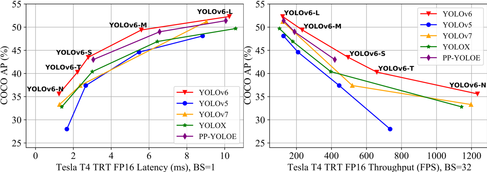

<p align="center">
  
</p>


## YOLOv6

Implementation of paper - [YOLOv6: A Single-Stage Object Detection Framework for Industrial Applications](https://arxiv.org/abs/2209.02976)

<p align="center">
  
</p>

YOLOv6 has a series of models for various industrial scenarios, including N/T/S/M/L, which the architectures vary considering the model size for better accuracy-speed trade-off. And some Bag-of-freebies methods are introduced to further improve the performance, such as self-distillation and more training epochs. For industrial deployment, we adopt QAT with channel-wise distillation and graph optimization to pursue extreme performance.

YOLOv6-N hits 35.9% AP on COCO dataset with 1234 FPS on T4. YOLOv6-S strikes 43.5% AP with 495 FPS, and the quantized YOLOv6-S model achieves 43.3% AP at a accelerated speed of 869 FPS on T4. YOLOv6-T/M/L also have excellent performance, which show higher accuracy than other detectors with the similar inference speed. 


## What's New

- Release M/L models and update N/T/S models with enhanced performance.⭐️ [Benchmark](#Benchmark)
- 2x faster training time.
- Fix the degration of performance when evaluating on 640x640 inputs. 
- Customized quantization methods. 🚀 [Quantization Tutorial](./tools/qat/README.md)


## Quick Start

### Install

```shell
git clone https://github.com/meituan/YOLOv6
cd YOLOv6
pip install -r requirements.txt
```

### Inference

First, download a pretrained model from the YOLOv6 [release](https://github.com/meituan/YOLOv6/releases/tag/0.2.0)

Second, run inference with `tools/infer.py`

```shell
python tools/infer.py --weights yolov6s.pt --source img.jpg / imgdir / video.mp4
```

### Training

Single GPU

```shell
python tools/train.py --batch 32 --conf configs/yolov6s_finetune.py --data data/dataset.yaml --device 0
```

Multi GPUs (DDP mode recommended)

```shell
python -m torch.distributed.launch --nproc_per_node 8 tools/train.py --batch 256 --conf configs/yolov6s_finetune.py --data data/dataset.yaml --device 0,1,2,3,4,5,6,7
```


<details>
<summary>Reproduce our results on COCO ⭐️</summary>

For nano model
```shell
python -m torch.distributed.launch --nproc_per_node 4 tools/train.py \
									--batch 128 \
									--conf configs/yolov6n.py \
									--data data/coco.yaml \
									--epoch 400 \
									--device 0,1,2,3 \
									--name yolov6n_coco
```

For s/tiny model
```shell
python -m torch.distributed.launch --nproc_per_node 8 tools/train.py \
									--batch 256 \
									--conf configs/yolov6s.py \ # configs/yolov6t.py
									--data data/coco.yaml \
									--epoch 400 \
									--device 0,1,2,3,4,5,6,7 \
									--name yolov6s_coco # yolov6t_coco
```

For m/l model
```shell
# Step 1: Training a base model
python -m torch.distributed.launch --nproc_per_node 8 tools/train.py \
									--batch 256 \
									--conf configs/yolov6m.py \ # configs/yolov6l.py
									--data data/coco.yaml \
									--epoch 300 \
									--device 0,1,2,3,4,5,6,7 \
									--name yolov6m_coco # yolov6l_coco
									
                                                                                      
# Step 2: Self-distillation training
python -m torch.distributed.launch --nproc_per_node 8 tools/train.py \
									--batch 256 \ # 128 for distillation of yolov6l 
									--conf configs/yolov6m.py \ # configs/yolov6l.py
									--data data/coco.yaml \
									--epoch 300 \
									--device 0,1,2,3,4,5,6,7 \
									--distill \
									--teacher_model_path runs/train/yolov6m_coco/weights/best_ckpt.pt \ # # yolov6l_coco
									--name yolov6m_coco # yolov6l_coco
							
```
</details>

- conf: select config file to specify network/optimizer/hyperparameters. Pretrained model path is recommended to be specified in the config file with the `pretrained` parameter if training on your custom dataset.
- data: prepare [COCO](http://cocodataset.org) dataset, [YOLO format coco labels](https://github.com/meituan/YOLOv6/releases/download/0.1.0/coco2017labels.zip) and specify dataset paths in data.yaml
- make sure your dataset structure as follows:
```
├── coco
│   ├── annotations
│   │   ├── instances_train2017.json
│   │   └── instances_val2017.json
│   ├── images
│   │   ├── train2017
│   │   └── val2017
│   ├── labels
│   │   ├── train2017
│   │   ├── val2017
│   ├── LICENSE
│   ├── README.txt
```

### Evaluation

Reproduce mAP on COCO val2017 dataset with 640×640 resolution ⭐️

```shell
python tools/eval.py --data data/coco.yaml --batch 32 --weights yolov6s.pt --task val --reproduce_640_eval
```
- verbose: set True to print mAP of each classes.
- do_coco_metric: set True / False to enable / disable pycocotools evaluation method.
- do_pr_metric: set True / False to print or not to print the precision and recall metrics.
- config-file: specify a config file to define all the eval params, for example: [yolov6n_with_eval_params.py](configs/experiment/yolov6n_with_eval_params.py)

<details>
<summary>Resume training</summary>

If your training process is corrupted, you can resume training by
```
# multi GPU training.
python -m torch.distributed.launch --nproc_per_node 8 tools/train.py --resume
```
Your can also specify a checkpoint path to `--resume` parameter by
```
# remember to replace /path/to/your/checkpoint/path to the checkpoint path which you want to resume training.
--resume /path/to/your/checkpoint/path

```

</details>

### Deployment

*  [ONNX](./deploy/ONNX)
*  [OpenCV Python/C++](./deploy/ONNX/OpenCV)
*  [OpenVINO](./deploy/OpenVINO)
*  [TensorRT](./deploy/TensorRT)

### Tutorials

*  [Train custom data](./docs/Train_custom_data.md)
*  [Test speed](./docs/Test_speed.md)
*  [Tutorial of Quantization for YOLOv6](./docs/Tutorial%20of%20Quantization.md)


## Benchmark
| Model                                                        | Size | mAP<sup>val<br/>0.5:0.95              | Speed<sup>T4<br/>trt fp16 b1 <br/>(fps) | Speed<sup>T4<br/>trt fp16 b32 <br/>(fps) | Params<br/><sup> (M) | FLOPs<br/><sup> (G) |
| :----------------------------------------------------------- | ---- | :------------------------------------ | --------------------------------------- | ---------------------------------------- | -------------------- | ------------------- |
| [**YOLOv6-N**](https://github.com/meituan/YOLOv6/releases/download/0.2.0/yolov6n.pt) | 640  | 35.9<sup>300e</sup><br/>36.3<sup>400e | 802                                     | 1234                                     | 4.3                  | 11.1                |
| [**YOLOv6-T**](https://github.com/meituan/YOLOv6/releases/download/0.2.0/yolov6t.pt) | 640  | 40.3<sup>300e</sup><br/>41.1<sup>400e | 449                                     | 659                                      | 15.0                 | 36.7                |
| [**YOLOv6-S**](https://github.com/meituan/YOLOv6/releases/download/0.2.0/yolov6s.pt) | 640  | 43.5<sup>300e</sup><br/>43.8<sup>400e | 358                                     | 495                                      | 17.2                 | 44.2                |
| [**YOLOv6-M**](https://github.com/meituan/YOLOv6/releases/download/0.2.0/yolov6m.pt) | 640  | 49.5                                  | 179                                     | 233                                      | 34.3                 | 82.2                |
| [**YOLOv6-L-ReLU**](https://github.com/meituan/YOLOv6/releases/download/0.2.0/yolov6l_relu.pt) | 640  | 51.7                                  | 113                                     | 149                                      | 58.5                 | 144.0               |
| [**YOLOv6-L**](https://github.com/meituan/YOLOv6/releases/download/0.2.0/yolov6l.pt) | 640  | 52.5                                  | 98                                      | 121                                      | 58.5                 | 144.0               |

### Quantized model 🚀 

| Model                 | Size | Precision | mAP<sup>val<br/>0.5:0.95 | Speed<sup>T4<br/>trt b1 <br/>(fps) | Speed<sup>T4<br/>trt b32 <br/>(fps) |
| :-------------------- | ---- | --------- | :----------------------- | ---------------------------------- | ----------------------------------- |
| **YOLOv6-N RepOpt** | 640  | INT8      | 34.8                     | 1114                               | 1828                                |
| **YOLOv6-N**        | 640  | FP16      | 35.9                     | 802                                | 1234                                |
| **YOLOv6-T RepOpt** | 640  | INT8      | 39.8                     | 741                                | 1167                                |
| **YOLOv6-T**        | 640  | FP16      | 40.3                     | 449                                | 659                                 |
| **YOLOv6-S RepOpt** | 640  | INT8      | 43.3                     | 619                                | 924                                 |
| **YOLOv6-S**        | 640  | FP16      | 43.5                     | 377                                | 541                                 |

- Speed is tested with TensorRT 8.4 on T4.
- Precision is figured on models for 300 epochs.

<details>
<summary>Legacy models</summary>

| Model           | Size        | mAP<sup>val<br/>0.5:0.95 | Speed<sup>V100<br/>fp16 b32 <br/>(ms) | Speed<sup>V100<br/>fp32 b32 <br/>(ms) | Speed<sup>T4<br/>trt fp16 b1 <br/>(fps) | Speed<sup>T4<br/>trt fp16 b32 <br/>(fps) | Params<br/><sup> (M) | FLOPs<br/><sup> (G) |
| :-------------- | ----------- | :----------------------- | :------------------------------------ | :------------------------------------ | ---------------------------------------- | ----------------------------------------- | --------------- | -------------- |
| [**YOLOv6-N**](https://github.com/meituan/YOLOv6/releases/download/0.1.0/yolov6n.pt)    | 416<br/>640 | 30.8<br/>35.0            | 0.3<br/>0.5                           | 0.4<br/>0.7                           | 1100<br/>788                             | 2716<br/>1242                             | 4.3<br/>4.3     | 4.7<br/>11.1   |
| [**YOLOv6-T**](https://github.com/meituan/YOLOv6/releases/download/0.1.0/yolov6t.pt) | 640         | 41.3                     | 0.9                                   | 1.5                                   | 425                                      | 602                                       | 15.0            | 36.7           |
| [**YOLOv6-S**](https://github.com/meituan/YOLOv6/releases/download/0.1.0/yolov6s.pt)    | 640         | 43.1                     | 1.0                                   | 1.7                                   | 373                                      | 520                                       | 17.2            | 44.2           |


</details>

- Results of the mAP and speed are evaluated on [COCO val2017](https://cocodataset.org/#download) dataset with the input resolution of 640×640.
- Refer to [Test speed](./docs/Test_speed.md) tutorial to reproduce the speed results of YOLOv6.
- Params and FLOPs of YOLOv6 are estimated on deployed models.
- For N/T/S models, we use more training epochs strategy.
- For M/L/L-ReLU models, we adopt self-distillation methods to further improve the performance.


 ## Third-party resources
 * YOLOv6 NCNN Android app demo: [ncnn-android-yolov6](https://github.com/FeiGeChuanShu/ncnn-android-yolov6) from [FeiGeChuanShu](https://github.com/FeiGeChuanShu)
 * YOLOv6 ONNXRuntime/MNN/TNN C++: [YOLOv6-ORT](https://github.com/DefTruth/lite.ai.toolkit/blob/main/lite/ort/cv/yolov6.cpp), [YOLOv6-MNN](https://github.com/DefTruth/lite.ai.toolkit/blob/main/lite/mnn/cv/mnn_yolov6.cpp) and [YOLOv6-TNN](https://github.com/DefTruth/lite.ai.toolkit/blob/main/lite/tnn/cv/tnn_yolov6.cpp) from [DefTruth](https://github.com/DefTruth)
 * YOLOv6 TensorRT Python: [yolov6-tensorrt-python](https://github.com/Linaom1214/TensorRT-For-YOLO-Series) from [Linaom1214](https://github.com/Linaom1214)
 * YOLOv6 TensorRT Windows C++: [yolort](https://github.com/zhiqwang/yolov5-rt-stack/tree/main/deployment/tensorrt-yolov6) from [Wei Zeng](https://github.com/Wulingtian)
 * [YOLOv6 web demo](https://huggingface.co/spaces/nateraw/yolov6) on [Huggingface Spaces](https://huggingface.co/spaces) with [Gradio](https://github.com/gradio-app/gradio). [](https://huggingface.co/spaces/nateraw/yolov6)
 * Tutorial: [How to train YOLOv6 on a custom dataset](https://blog.roboflow.com/how-to-train-yolov6-on-a-custom-dataset/) <a href="https://colab.research.google.com/drive/1YnbqOinBZV-c9I7fk_UL6acgnnmkXDMM"></a>
 * Demo of YOLOv6 inference on Google Colab [](https://colab.research.google.com/github/mahdilamb/YOLOv6/blob/main/inference.ipynb)

  
### [FAQ（Continuously updated）](https://github.com/meituan/YOLOv6/wiki/FAQ%EF%BC%88Continuously-updated%EF%BC%89)
