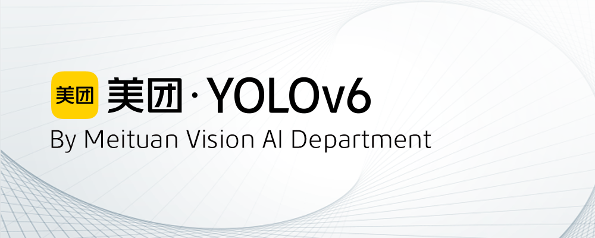

<p align="center">
  
</p>

English | [简体中文](README_cn.md)


## YOLOv6-Face

Implementation based on [YOLOv6 v3.0 code](https://github.com/meituan/YOLOv6/tree/main).


New Feature
- Face-landmarks localization
- Repulsion loss
- Same-channel Dehead


## Performance on WIDERFACE
| Model                                                        | Size | Easy | Medium | Hard | Speed<sup>T4<br/>trt fp16 b1 <br/>(fps) | Speed<sup>T4<br/>trt fp16 b32 <br/>(fps) | Params<br/><sup> (M) | FLOPs<br/><sup> (G) |
| :----------------------------------------------------------- | ---- | :--- | ------ | ---- | --------------------------------------- | ---------------------------------------- | -------------------- | ------------------- |
| [**YOLOv6-N**](https://github.com/meituan/YOLOv6/releases/download/0.3.1/yolov6n_face.pt) | 640  | 95.0 | 92.4   | 80.4 | 797                                     | 1313                                     | 4.63                 | 11.35               |
| [**YOLOv6-S**](https://github.com/meituan/YOLOv6/releases/download/0.3.1/yolov6s_face.pt) | 640  | 96.2 | 94.7   | 85.1 | 339                                     | 484                                      | 12.41                | 32.45               |
| [**YOLOv6-M**](https://github.com/meituan/YOLOv6/releases/download/0.3.1/yolov6m_face.pt) | 640  | 97.0 | 95.3   | 86.3 | 188                                     | 240                                      | 24.85                | 70.59               |
| [**YOLOv6-L**](https://github.com/meituan/YOLOv6/releases/download/0.3.1/yolov6l_face.pt) | 640  | 97.2 | 95.9   | 87.5 | 102                                     | 121                                      | 56.77                | 159.24              |

#### Table Notes

- All checkpoints are fine-tuned from COCO pretrained model for 300 epochs without distillation.
- Results of the mAP and speed are evaluated on [WIDER FACE](http://shuoyang1213.me/WIDERFACE/) dataset with the input resolution of 640×640.
- Speed is tested with TensorRT 8.2 on T4.
- Refer to [Test speed](./docs/Test_speed.md) tutorial to reproduce the speed results of YOLOv6.
- Params and FLOPs of YOLOv6 are estimated on deployed models.


## Quick Start
<details open>
<summary> Install</summary>


```shell
git clone https://github.com/meituan/YOLOv6
cd YOLOv6
git checkout yolov6-face
pip install -r requirements.txt
```
</details>

<details open>
<summary> Training </summary>

Single GPU

```shell
python tools/train.py --batch 8 --conf configs/yolov6s_finetune.py --data data/WIDER_FACE.yaml --fuse_ab --device 0
```

Multi GPUs (DDP mode recommended)

```shell
python -m torch.distributed.launch --nproc_per_node 8 tools/train.py --batch 64 --conf configs/yolov6s_finetune.py --data data/WIDER_FACE.yaml --fuse_ab --device 0,1,2,3,4,5,6,7
```
- fuse_ab: Anchor Aided Training Mode
- conf: select config file to specify network/optimizer/hyperparameters. We recommend to apply yolov6n/s/m/l_finetune.py when training on WIDER FACE or your custom dataset.
- data: prepare dataset and specify dataset paths in data.yaml ( [WIDERFACE](http://shuoyang1213.me/WIDERFACE/), [YOLO format widerface labels](https://github.com/meituan/YOLOv6/releases/download/0.3.1/widerface_yololabels.zip) )
- make sure your dataset structure as follows:
```
├── widerface
│   ├── images
│   │   ├── train
│   │   └── val
│   ├── labels
│   │   ├── train
│   │   ├── val

```
</details>


<details open>
<summary>Inference</summary>

First, download a pretrained model from the YOLOv6 [release](https://github.com/meituan/YOLOv6/releases/tag/0.3.1) or use your trained model to do inference.

Second, run inference with `tools/infer.py`

```shell
python tools/infer.py --weights yolov6s_face.pt --source ../widerface/images/val/ --yaml data/WIDER_FACE.yaml --conf 0.02 --not-save-img --save-txt-widerface --name widerface_yolov6s
```

</details>

<details open>
<summary> Evaluation</summary>

```shell
cd widerface_evaluate
python evaluation.py --pred ../runs/inference/widerface_yolov6s/labels/
```
</details>

<details>
<summary> Deployment</summary>

*  [ONNX](./deploy/ONNX)
*  [OpenCV Python/C++](./deploy/ONNX/OpenCV)
*  [OpenVINO](./deploy/OpenVINO)
*  [TensorRT](./deploy/TensorRT)
</details>

<details>
<summary> Tutorials</summary>

*  [User Guide(zh_CN)](https://yolov6-docs.readthedocs.io/zh_CN/latest/) 
*  [Train COCO Dataset](./docs/Train_coco_data.md)
*  [Train custom data](./docs/Train_custom_data.md)
*  [Test speed](./docs/Test_speed.md)
*  [Tutorial of Quantization for YOLOv6](./docs/Tutorial%20of%20Quantization.md)
</details>

<details>
<summary> Third-party resources</summary>

 * YOLOv6 NCNN Android app demo: [ncnn-android-yolov6](https://github.com/FeiGeChuanShu/ncnn-android-yolov6) from [FeiGeChuanShu](https://github.com/FeiGeChuanShu)

 * YOLOv6 ONNXRuntime/MNN/TNN C++: [YOLOv6-ORT](https://github.com/DefTruth/lite.ai.toolkit/blob/main/lite/ort/cv/yolov6.cpp), [YOLOv6-MNN](https://github.com/DefTruth/lite.ai.toolkit/blob/main/lite/mnn/cv/mnn_yolov6.cpp) and [YOLOv6-TNN](https://github.com/DefTruth/lite.ai.toolkit/blob/main/lite/tnn/cv/tnn_yolov6.cpp) from [DefTruth](https://github.com/DefTruth)

 * YOLOv6 TensorRT Python: [yolov6-tensorrt-python](https://github.com/Linaom1214/TensorRT-For-YOLO-Series) from [Linaom1214](https://github.com/Linaom1214)

 * YOLOv6 TensorRT Windows C++: [yolort](https://github.com/zhiqwang/yolov5-rt-stack/tree/main/deployment/tensorrt-yolov6) from [Wei Zeng](https://github.com/Wulingtian)

 * [YOLOv6 web demo](https://huggingface.co/spaces/nateraw/yolov6) on [Huggingface Spaces](https://huggingface.co/spaces) with [Gradio](https://github.com/gradio-app/gradio). [](https://huggingface.co/spaces/nateraw/yolov6)

 * [Interactive demo](https://yolov6.dagshubusercontent.com/) on [DagsHub](https://dagshub.com) with [Streamlit](https://github.com/streamlit/streamlit) 

 * Tutorial: [How to train YOLOv6 on a custom dataset](https://blog.roboflow.com/how-to-train-yolov6-on-a-custom-dataset/) <a href="https://colab.research.google.com/drive/1YnbqOinBZV-c9I7fk_UL6acgnnmkXDMM"></a>

 * YouTube Tutorial: [How to train YOLOv6 on a custom dataset](https://youtu.be/fFCWrMFH2UY)

 * Demo of YOLOv6 inference on Google Colab [](https://colab.research.google.com/github/mahdilamb/YOLOv6/blob/main/inference.ipynb)

 * Blog post: [YOLOv6 Object Detection – Paper Explanation and Inference](https://learnopencv.com/yolov6-object-detection/)

   </details>

### [FAQ（Continuously updated）](https://github.com/meituan/YOLOv6/wiki/FAQ%EF%BC%88Continuously-updated%EF%BC%89)

If you have any questions, welcome to join our WeChat group to discuss and exchange.
<p align="center">
  
</p>
