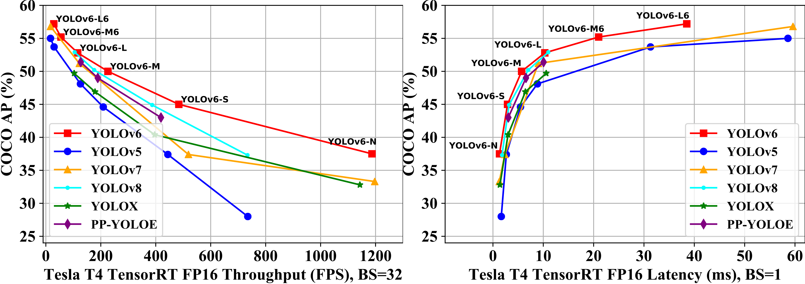

<p align="center">
  
</p>

English | [简体中文](README_cn.md)

 <br>

 <div>
    </a>
    <a href="https://colab.research.google.com/github/meituan/YOLOv6/blob/main/turtorial.ipynb"></a>
     <a href="https://www.kaggle.com/code/housanduo/yolov6"></a>
  </div>
 <br>

## YOLOv6

Implementation of paper:
- [YOLOv6 v3.0: A Full-Scale Reloading](https://arxiv.org/abs/2301.05586) 🔥
- [YOLOv6: A Single-Stage Object Detection Framework for Industrial Applications](https://arxiv.org/abs/2209.02976)

<p align="center">
  
</p>


## What's New
- [2023.09.15] Release [YOLOv6-Segmentation](https://github.com/meituan/YOLOv6/tree/yolov6-seg). 🚀 [Performance](https://github.com/meituan/YOLOv6/tree/yolov6-seg#yolov6-segmentation)
- [2023.04.28] Release [YOLOv6Lite](configs/yolov6_lite/README.md) models on mobile or CPU. ⭐️ [Mobile Benchmark](#Mobile-Benchmark)
- [2023.03.10] Release [YOLOv6-Face](https://github.com/meituan/YOLOv6/tree/yolov6-face). 🔥 [Performance](https://github.com/meituan/YOLOv6/tree/yolov6-face#performance-on-widerface)
- [2023.03.02] Update [base models](configs/base/README.md) to version 3.0.
- [2023.01.06] Release P6 models and enhance the performance of P5 models. ⭐️ [Benchmark](#Benchmark)
- [2022.11.04] Release [base models](configs/base/README.md) to simplify the training and deployment process.
- [2022.09.06] Customized quantization methods. 🚀 [Quantization Tutorial](./tools/qat/README.md)
- [2022.09.05] Release M/L models and update N/T/S models with enhanced performance.
- [2022.06.23] Release N/T/S models with excellent performance.

## Benchmark
| Model                                                        | Size | mAP<sup>val<br/>0.5:0.95 | Speed<sup>T4<br/>trt fp16 b1 <br/>(fps) | Speed<sup>T4<br/>trt fp16 b32 <br/>(fps) | Params<br/><sup> (M) | FLOPs<br/><sup> (G) |
| :----------------------------------------------------------- | ---- | :----------------------- | --------------------------------------- | ---------------------------------------- | -------------------- | ------------------- |
| [**YOLOv6-N**](https://github.com/meituan/YOLOv6/releases/download/0.4.0/yolov6n.pt) | 640  | 37.5                     | 779                                     | 1187                                     | 4.7                  | 11.4                |
| [**YOLOv6-S**](https://github.com/meituan/YOLOv6/releases/download/0.4.0/yolov6s.pt) | 640  | 45.0                     | 339                                     | 484                                      | 18.5                 | 45.3                |
| [**YOLOv6-M**](https://github.com/meituan/YOLOv6/releases/download/0.4.0/yolov6m.pt) | 640  | 50.0                     | 175                                     | 226                                      | 34.9                 | 85.8                |
| [**YOLOv6-L**](https://github.com/meituan/YOLOv6/releases/download/0.4.0/yolov6l.pt) | 640  | 52.8                     | 98                                      | 116                                      | 59.6                 | 150.7               |
|                              |                               |                                |                    |                        |
| [**YOLOv6-N6**](https://github.com/meituan/YOLOv6/releases/download/0.4.0/yolov6n6.pt) | 1280 | 44.9                     | 228                                     | 281                                      | 10.4                 | 49.8                |
| [**YOLOv6-S6**](https://github.com/meituan/YOLOv6/releases/download/0.4.0/yolov6s6.pt) | 1280 | 50.3                     | 98                                      | 108                                      | 41.4                 | 198.0               |
| [**YOLOv6-M6**](https://github.com/meituan/YOLOv6/releases/download/0.4.0/yolov6m6.pt) | 1280 | 55.2                     | 47                                      | 55                                       | 79.6                 | 379.5               |
| [**YOLOv6-L6**](https://github.com/meituan/YOLOv6/releases/download/0.4.0/yolov6l6.pt) | 1280 | 57.2                     | 26                                      | 29                                       | 140.4                | 673.4               |
<details>
<summary>Table Notes</summary>

- All checkpoints are trained with self-distillation except for YOLOv6-N6/S6 models trained to 300 epochs without distillation.
- Results of the mAP and speed are evaluated on [COCO val2017](https://cocodataset.org/#download) dataset with the input resolution of 640×640 for P5 models and 1280x1280 for P6 models.
- Speed is tested with TensorRT 7.2 on T4.
- Refer to [Test speed](./docs/Test_speed.md) tutorial to reproduce the speed results of YOLOv6.
- Params and FLOPs of YOLOv6 are estimated on deployed models.
</details>

<details>
<summary>Legacy models</summary>

| Model                                                        | Size | mAP<sup>val<br/>0.5:0.95              | Speed<sup>T4<br/>trt fp16 b1 <br/>(fps) | Speed<sup>T4<br/>trt fp16 b32 <br/>(fps) | Params<br/><sup> (M) | FLOPs<br/><sup> (G) |
| :----------------------------------------------------------- | ---- | :------------------------------------ | --------------------------------------- | ---------------------------------------- | -------------------- | ------------------- |
| [**YOLOv6-N**](https://github.com/meituan/YOLOv6/releases/download/0.2.0/yolov6n.pt) | 640  | 35.9<sup>300e</sup><br/>36.3<sup>400e | 802                                     | 1234                                     | 4.3                  | 11.1                |
| [**YOLOv6-T**](https://github.com/meituan/YOLOv6/releases/download/0.2.0/yolov6t.pt) | 640  | 40.3<sup>300e</sup><br/>41.1<sup>400e | 449                                     | 659                                      | 15.0                 | 36.7                |
| [**YOLOv6-S**](https://github.com/meituan/YOLOv6/releases/download/0.2.0/yolov6s.pt) | 640  | 43.5<sup>300e</sup><br/>43.8<sup>400e | 358                                     | 495                                      | 17.2                 | 44.2                |
| [**YOLOv6-M**](https://github.com/meituan/YOLOv6/releases/download/0.2.0/yolov6m.pt) | 640  | 49.5                                  | 179                                     | 233                                      | 34.3                 | 82.2                |
| [**YOLOv6-L-ReLU**](https://github.com/meituan/YOLOv6/releases/download/0.2.0/yolov6l_relu.pt) | 640  | 51.7                                  | 113                                     | 149                                      | 58.5                 | 144.0               |
| [**YOLOv6-L**](https://github.com/meituan/YOLOv6/releases/download/0.2.0/yolov6l.pt) | 640  | 52.5                                  | 98                                      | 121                                      | 58.5                 | 144.0               |
- Speed is tested with TensorRT 7.2 on T4.
### Quantized model 🚀

| Model                 | Size | Precision | mAP<sup>val<br/>0.5:0.95 | Speed<sup>T4<br/>trt b1 <br/>(fps) | Speed<sup>T4<br/>trt b32 <br/>(fps) |
| :-------------------- | ---- | --------- | :----------------------- | ---------------------------------- | ----------------------------------- |
| **YOLOv6-N RepOpt** | 640  | INT8      | 34.8                     | 1114                               | 1828                                |
| **YOLOv6-N**        | 640  | FP16      | 35.9                     | 802                                | 1234                                |
| **YOLOv6-T RepOpt** | 640  | INT8      | 39.8                     | 741                                | 1167                                |
| **YOLOv6-T**        | 640  | FP16      | 40.3                     | 449                                | 659                                 |
| **YOLOv6-S RepOpt** | 640  | INT8      | 43.3                     | 619                                | 924                                 |
| **YOLOv6-S**        | 640  | FP16      | 43.5                     | 377                                | 541                                 |

- Speed is tested with TensorRT 8.4 on T4.
- Precision is figured on models for 300 epochs.

</details>

## Mobile Benchmark
| Model | Size | mAP<sup>val<br/>0.5:0.95 | sm8350<br/><sup>(ms) | mt6853<br/><sup>(ms) | sdm660<br/><sup>(ms) |Params<br/><sup> (M) |   FLOPs<br/><sup> (G) |
| :----------------------------------------------------------- | ---- | -------------------- | -------------------- | -------------------- | -------------------- | -------------------- | -------------------- |
| [**YOLOv6Lite-S**](https://github.com/meituan/YOLOv6/releases/download/0.4.0/yolov6lite_s.pt) | 320*320 | 22.4                     | 7.99                     | 11.99                     | 41.86                     | 0.55                     | 0.56                     |
| [**YOLOv6Lite-M**](https://github.com/meituan/YOLOv6/releases/download/0.4.0/yolov6lite_m.pt) | 320*320 | 25.1                     | 9.08                     | 13.27                     | 47.95                     | 0.79                     | 0.67                     |
| [**YOLOv6Lite-L**](https://github.com/meituan/YOLOv6/releases/download/0.4.0/yolov6lite_l.pt) | 320*320 | 28.0                     | 11.37                     | 16.20                     | 61.40                     | 1.09                     | 0.87                     |
| [**YOLOv6Lite-L**](https://github.com/meituan/YOLOv6/releases/download/0.4.0/yolov6lite_l.pt) | 320*192 | 25.0                     | 7.02                     | 9.66                     | 36.13                     | 1.09                     | 0.52                     |
| [**YOLOv6Lite-L**](https://github.com/meituan/YOLOv6/releases/download/0.4.0/yolov6lite_l.pt) | 224*128 | 18.9                     | 3.63                     | 4.99                     | 17.76                     | 1.09                     | 0.24                     |

<details>
<summary>Table Notes</summary>

- From the perspective of model size and input image ratio, we have built a series of models on the mobile terminal to facilitate flexible applications in different scenarios.
- All checkpoints are trained with 400 epochs without distillation.
- Results of the mAP and speed are evaluated on [COCO val2017](https://cocodataset.org/#download) dataset, and the input resolution is the Size in the table.
- Speed is tested on MNN 2.3.0 AArch64 with 2 threads by arm82 acceleration. The inference warm-up is performed 10 times, and the cycle is performed 100 times.
- Qualcomm 888(sm8350), Dimensity 720(mt6853) and Qualcomm 660(sdm660) correspond to chips with different performances at the high, middle and low end respectively, which can be used as a reference for model capabilities under different chips.
- Refer to [Test NCNN Speed](./docs/Test_NCNN_speed.md) tutorial to reproduce the NCNN speed results of YOLOv6Lite.

</details>

## Quick Start
<details>
<summary> Install</summary>


```shell
git clone https://github.com/meituan/YOLOv6
cd YOLOv6
pip install -r requirements.txt
```
</details>


<details>
<summary> Reproduce our results on COCO</summary>

Please refer to [Train COCO Dataset](./docs/Train_coco_data.md).

</details>

<details open>
<summary> Finetune on custom data</summary>

Single GPU

```shell
# P5 models
python tools/train.py --batch 32 --conf configs/yolov6s_finetune.py --data data/dataset.yaml --fuse_ab --device 0
# P6 models
python tools/train.py --batch 32 --conf configs/yolov6s6_finetune.py --data data/dataset.yaml --img 1280 --device 0
```

Multi GPUs (DDP mode recommended)

```shell
# P5 models
python -m torch.distributed.launch --nproc_per_node 8 tools/train.py --batch 256 --conf configs/yolov6s_finetune.py --data data/dataset.yaml --fuse_ab --device 0,1,2,3,4,5,6,7
# P6 models
python -m torch.distributed.launch --nproc_per_node 8 tools/train.py --batch 128 --conf configs/yolov6s6_finetune.py --data data/dataset.yaml --img 1280 --device 0,1,2,3,4,5,6,7
```
- fuse_ab: add anchor-based auxiliary branch and use Anchor Aided Training Mode (Not supported on P6 models currently)
- conf: select config file to specify network/optimizer/hyperparameters. We recommend to apply yolov6n/s/m/l_finetune.py when training on your custom dataset.
- data: prepare dataset and specify dataset paths in data.yaml ( [COCO](http://cocodataset.org), [YOLO format coco labels](https://github.com/meituan/YOLOv6/releases/download/0.1.0/coco2017labels.zip) )
- make sure your dataset structure as follows:
```
├── coco
│   ├── annotations
│   │   ├── instances_train2017.json
│   │   └── instances_val2017.json
│   ├── images
│   │   ├── train2017
│   │   └── val2017
│   ├── labels
│   │   ├── train2017
│   │   ├── val2017
│   ├── LICENSE
│   ├── README.txt
```

YOLOv6 supports different input resolution modes. For details, see [How to Set the Input Size](./docs/About_training_size.md).

</details>

<details>
<summary>Resume training</summary>

If your training process is corrupted, you can resume training by
```
# single GPU training.
python tools/train.py --resume

# multi GPU training.
python -m torch.distributed.launch --nproc_per_node 8 tools/train.py --resume
```
Above command will automatically find the latest checkpoint in YOLOv6 directory, then resume the training process.

Your can also specify a checkpoint path to `--resume` parameter by
```
# remember to replace /path/to/your/checkpoint/path to the checkpoint path which you want to resume training.
--resume /path/to/your/checkpoint/path
```
This will resume from the specific checkpoint you provide.

</details>

<details open>
<summary> Evaluation</summary>

Reproduce mAP on COCO val2017 dataset with 640×640 or 1280x1280 resolution

```shell
# P5 models
python tools/eval.py --data data/coco.yaml --batch 32 --weights yolov6s.pt --task val --reproduce_640_eval
# P6 models
python tools/eval.py --data data/coco.yaml --batch 32 --weights yolov6s6.pt --task val --reproduce_640_eval --img 1280
```
- verbose: set True to print mAP of each classes.
- do_coco_metric: set True / False to enable / disable pycocotools evaluation method.
- do_pr_metric: set True / False to print or not to print the precision and recall metrics.
- config-file: specify a config file to define all the eval params, for example: [yolov6n_with_eval_params.py](configs/experiment/yolov6n_with_eval_params.py)
</details>


<details>
<summary>Inference</summary>

First, download a pretrained model from the YOLOv6 [release](https://github.com/meituan/YOLOv6/releases/tag/0.4.0) or use your trained model to do inference.

Second, run inference with `tools/infer.py`

```shell
# P5 models
python tools/infer.py --weights yolov6s.pt --source img.jpg / imgdir / video.mp4
# P6 models
python tools/infer.py --weights yolov6s6.pt --img 1280 1280 --source img.jpg / imgdir / video.mp4
```
If you want to inference on local camera or  web camera, you can run:
```shell
# P5 models
python tools/infer.py --weights yolov6s.pt --webcam --webcam-addr 0
# P6 models
python tools/infer.py --weights yolov6s6.pt --img 1280 1280 --webcam --webcam-addr 0
```
`webcam-addr` can be local camera number id or rtsp address.
</details>

<details>
<summary> Deployment</summary>

*  [ONNX](./deploy/ONNX)
*  [OpenCV Python/C++](./deploy/ONNX/OpenCV)
*  [OpenVINO](./deploy/OpenVINO)
*  [TensorRT](./deploy/TensorRT)
*  [NCNN](./deploy/NCNN)
*  [Android](./deploy/NCNN/Android)
</details>

<details open>
<summary> Tutorials</summary>

*  [User Guide(zh_CN)](https://yolov6-docs.readthedocs.io/zh_CN/latest/)
*  [Train COCO Dataset](./docs/Train_coco_data.md)
*  [Train custom data](./docs/Train_custom_data.md)
*  [Test speed](./docs/Test_speed.md)
*  [Tutorial of Quantization for YOLOv6](./docs/Tutorial%20of%20Quantization.md)
</details>

<details>
<summary> Third-party resources</summary>

 * YOLOv6 Training with Amazon Sagemaker: [yolov6-sagemaker](https://github.com/ashwincc/yolov6-sagemaker) from [ashwincc](https://github.com/ashwincc)  

 * YOLOv6 NCNN Android app demo: [ncnn-android-yolov6](https://github.com/FeiGeChuanShu/ncnn-android-yolov6) from [FeiGeChuanShu](https://github.com/FeiGeChuanShu)

 * YOLOv6 ONNXRuntime/MNN/TNN C++: [YOLOv6-ORT](https://github.com/DefTruth/lite.ai.toolkit/blob/main/lite/ort/cv/yolov6.cpp), [YOLOv6-MNN](https://github.com/DefTruth/lite.ai.toolkit/blob/main/lite/mnn/cv/mnn_yolov6.cpp) and [YOLOv6-TNN](https://github.com/DefTruth/lite.ai.toolkit/blob/main/lite/tnn/cv/tnn_yolov6.cpp) from [DefTruth](https://github.com/DefTruth)

 * YOLOv6 TensorRT Python: [yolov6-tensorrt-python](https://github.com/Linaom1214/TensorRT-For-YOLO-Series) from [Linaom1214](https://github.com/Linaom1214)

 * YOLOv6 TensorRT Windows C++: [yolort](https://github.com/zhiqwang/yolov5-rt-stack/tree/main/deployment/tensorrt-yolov6) from [Wei Zeng](https://github.com/Wulingtian)

 * [YOLOv6 web demo](https://huggingface.co/spaces/nateraw/yolov6) on [Huggingface Spaces](https://huggingface.co/spaces) with [Gradio](https://github.com/gradio-app/gradio). [](https://huggingface.co/spaces/nateraw/yolov6)

 * [Interactive demo](https://yolov6.dagshubusercontent.com/) on [DagsHub](https://dagshub.com) with [Streamlit](https://github.com/streamlit/streamlit)

 * Tutorial: [How to train YOLOv6 on a custom dataset](https://blog.roboflow.com/how-to-train-yolov6-on-a-custom-dataset/) <a href="https://colab.research.google.com/drive/1YnbqOinBZV-c9I7fk_UL6acgnnmkXDMM"></a>

 * YouTube Tutorial: [How to train YOLOv6 on a custom dataset](https://youtu.be/fFCWrMFH2UY)

 * Demo of YOLOv6 inference on Google Colab [](https://colab.research.google.com/github/mahdilamb/YOLOv6/blob/main/inference.ipynb)

 * Blog post: [YOLOv6 Object Detection – Paper Explanation and Inference](https://learnopencv.com/yolov6-object-detection/)

   </details>

### [FAQ（Continuously updated）](https://github.com/meituan/YOLOv6/wiki/FAQ%EF%BC%88Continuously-updated%EF%BC%89)

If you have any questions, welcome to join our WeChat group to discuss and exchange.
<p align="center">
  
</p>
