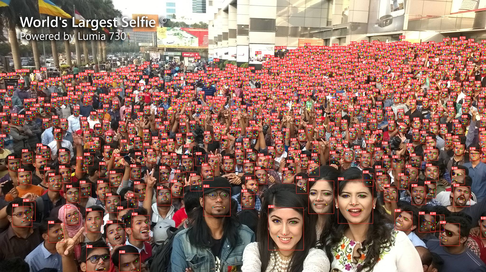

<p align="center">
  
</p>

简体中文 | [English](README.md)

## YOLOv6-Face

基于 [YOLOv6 v3.0 分支](https://github.com/meituan/YOLOv6/tree/main) 代码实现人脸检测任务。


新特性
- 人脸关键点定位
- Repulsion 损失函数
- 相同通道解耦头

<p align="center">
  
</p>

## WIDERFACE 模型指标
| Model                                                        | Size | Easy | Medium | Hard | Speed<sup>T4<br/>trt fp16 b1 <br/>(fps) | Speed<sup>T4<br/>trt fp16 b32 <br/>(fps) | Params<br/><sup> (M) | FLOPs<br/><sup> (G) |
| :----------------------------------------------------------- | ---- | :--- | ------ | ---- | --------------------------------------- | ---------------------------------------- | -------------------- | ------------------- |
| [**YOLOv6-N**](https://github.com/meituan/YOLOv6/releases/download/0.3.1/yolov6n_face.pt) | 640  | 95.0 | 92.4   | 80.4 | 797                                     | 1313                                     | 4.63                 | 11.35               |
| [**YOLOv6-S**](https://github.com/meituan/YOLOv6/releases/download/0.3.1/yolov6s_face.pt) | 640  | 96.2 | 94.7   | 85.1 | 339                                     | 484                                      | 12.41                | 32.45               |
| [**YOLOv6-M**](https://github.com/meituan/YOLOv6/releases/download/0.3.1/yolov6m_face.pt) | 640  | 97.0 | 95.3   | 86.3 | 188                                     | 240                                      | 24.85                | 70.59               |
| [**YOLOv6-L**](https://github.com/meituan/YOLOv6/releases/download/0.3.1/yolov6l_face.pt) | 640  | 97.2 | 95.9   | 87.5 | 102                                     | 121                                      | 56.77                | 159.24              |

#### 表格备注

- 以上模型均在COCO预训练模型上微调300轮之后的结果.
- mAP 和速度指标是在 [WIDER FACE](http://shuoyang1213.me/WIDERFACE/) 数据集上评估的，模型输入分辨率为 640×640.
- 速度是在 T4 上测试的，TensorRT 版本为 8.2.
- 复现 YOLOv6 的速度指标，请查看[速度测试](./docs/Test_speed.md) 教程.
- YOLOv6 的参数和计算量是在推理模式下计算的.


## 快速开始

<details open>
<summary> 安装</summary>


```shell
git clone https://github.com/meituan/YOLOv6
cd YOLOv6
git checkout yolov6-face
pip install -r requirements.txt
```
</details>

<details open>
<summary> 训练 </summary>

单卡

```shell
python tools/train.py --batch 8 --conf configs/yolov6s_finetune.py --data data/WIDER_FACE.yaml --fuse_ab --device 0
```

多卡 (推荐使用 DDP 模式)

```shell
python -m torch.distributed.launch --nproc_per_node 8 tools/train.py --batch 64 --conf configs/yolov6s_finetune.py --data data/WIDER_FACE.yaml --fuse_ab --device 0,1,2,3,4,5,6,7
```
- fuse_ab: 使用联合锚点训练模式
- conf: 配置文件路径，里面包含网络结构、优化器配置、超参数信息。如果您是在自己的数据集训练，我们推荐您使用yolov6n/s/m/l_finetune.py配置文件
- data: 数据集配置文件，以 WIDERFACE 数据集为例，您可以在 [WIDERFACE](http://shuoyang1213.me/WIDERFACE/) 下载数据, 在这里下载[YOLO 格式标签](https://github.com/meituan/YOLOv6/releases/download/0.3.1/widerface_yololabels.zip) 
- 确保您的数据集按照下面这种格式来组织；
```
├── widerface
│   ├── images
│   │   ├── train
│   │   └── val
│   ├── labels
│   │   ├── train
│   │   ├── val

```
</details>


<details open>
<summary>推理</summary>

首先，从[release 页面](https://github.com/meituan/YOLOv6/releases/tag/0.3.1) 下载一个训练好的模型权重文件，或选择您自己训练的模型；

然后，通过 `tools/infer.py` 文件进行推理。

```shell
python tools/infer.py --weights yolov6s_face.pt --source ../widerface/images/val/ --yaml data/WIDER_FACE.yaml --conf 0.02 --not-save-img --save-txt-widerface --name widerface_yolov6s
```

</details>

<details open>
<summary> WIDERFACE 评估 </summary>

```shell
cd widerface_evaluate
python evaluation.py --pred ../runs/inference/widerface_yolov6s/labels/
```
</details>

<details>
<summary> 部署 </summary>

*  [ONNX](./deploy/ONNX)
*  [OpenCV Python/C++](./deploy/ONNX/OpenCV)
*  [OpenVINO](./deploy/OpenVINO)
*  [TensorRT](./deploy/TensorRT)
</details>

<details>
<summary> 教程 </summary>

*  [用户手册（中文版）](https://yolov6-docs.readthedocs.io/zh_CN/latest/) 
*  [训练 COCO 数据集](./docs/Train_coco_data.md)
*  [训练自定义数据集](./docs/Train_custom_data.md)
*  [测速](./docs/Test_speed.md)
*  [ YOLOv6 量化教程](./docs/Tutorial%20of%20Quantization.md)
</details>


<details>
<summary> 第三方资源 </summary>

 * YOLOv6 NCNN Android app demo: [ncnn-android-yolov6](https://github.com/FeiGeChuanShu/ncnn-android-yolov6) from [FeiGeChuanShu](https://github.com/FeiGeChuanShu)
 * YOLOv6 ONNXRuntime/MNN/TNN C++: [YOLOv6-ORT](https://github.com/DefTruth/lite.ai.toolkit/blob/main/lite/ort/cv/yolov6.cpp), [YOLOv6-MNN](https://github.com/DefTruth/lite.ai.toolkit/blob/main/lite/mnn/cv/mnn_yolov6.cpp) and [YOLOv6-TNN](https://github.com/DefTruth/lite.ai.toolkit/blob/main/lite/tnn/cv/tnn_yolov6.cpp) from [DefTruth](https://github.com/DefTruth)
 * YOLOv6 TensorRT Python: [yolov6-tensorrt-python](https://github.com/Linaom1214/TensorRT-For-YOLO-Series) from [Linaom1214](https://github.com/Linaom1214)
 * YOLOv6 TensorRT Windows C++: [yolort](https://github.com/zhiqwang/yolov5-rt-stack/tree/main/deployment/tensorrt-yolov6) from [Wei Zeng](https://github.com/Wulingtian)
 * [YOLOv6 web demo](https://huggingface.co/spaces/nateraw/yolov6) on [Huggingface Spaces](https://huggingface.co/spaces) with [Gradio](https://github.com/gradio-app/gradio). [](https://huggingface.co/spaces/nateraw/yolov6)
 * 教程: [如何用 YOLOv6 训练自己的数据集](https://blog.roboflow.com/how-to-train-yolov6-on-a-custom-dataset/) <a href="https://colab.research.google.com/drive/1YnbqOinBZV-c9I7fk_UL6acgnnmkXDMM"></a>
 * YOLOv6 在 Google Colab 上的推理 Demo [](https://colab.research.google.com/github/mahdilamb/YOLOv6/blob/main/inference.ipynb)
</details>

### [FAQ（持续更新）](https://github.com/meituan/YOLOv6/wiki/FAQ%EF%BC%88Continuously-updated%EF%BC%89)

如果您有任何问题，欢迎加入我们的微信群一起讨论交流！
<p align="center">
  
</p>