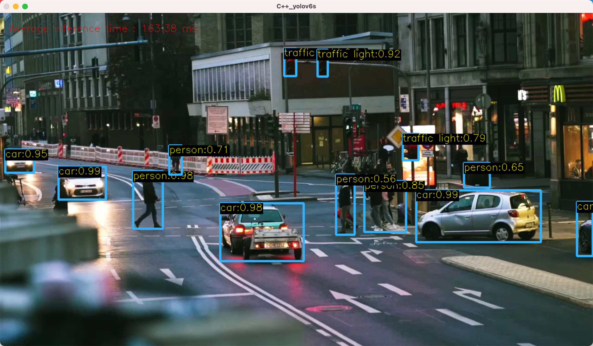
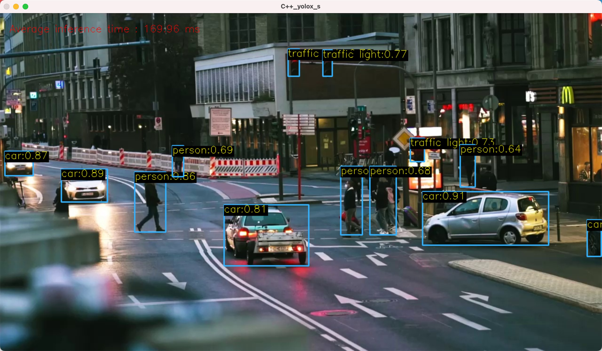

#  Object Detection using YOLOv5/YOLOv6/YOLOX and OpenCV DNN (Python/C++)

## 0. Install Dependancies
```
OpenCV >= 4.5.4
```
Only **OpenCV >= 4.5.4** can read onnx model file by dnn module.

## 1. Usage
Change work directory to `/path/to/YOLOv6/deploy/ONNX/OpenCV`
### 1.1 Python

- YOLOv5 & YOLOv6:
```Python
python yolo.py --model /path/to/onnx/yolov5n.onnx --img /path/to/sample.jpg --classesFile /path/to/coco.names
                                     yolov5s.onnx
                                     yolov5m.onnx
                                     yolov6n.onnx
                                     yolov6s.onnx
                                     yolov6t.onnx
```
- YOLOX:
```Python
python yolox.py --model /path/to/onnx/yolox_nano.onnx --img /path/to/sample.jpg --classesFile /path/to/coco.names
                                      yolox_tiny.onnx
                                      yolox_s.onnx
                                      yolox_m.onnx
```

### 1.2 CMake C++ Linux YOLOv5
```C++ Linux
cd yolov5    // modify CMakeLists.txt
mkdir build
cd build
cmake ..
make
./yolov5 /path/to/onnx/yolov5n.onnx /path/to/sample.jpg /path/to/coco.names
                       yolov5s.onnx
                       yolov5m.onnx
```

### 1.3 CMake C++ Linux YOLOv6
```C++ Linux
cd yolov6    // modify CMakeLists.txt
mkdir build
cd build
cmake ..
make
./yolov6 /path/to/onnx/yolov6n.onnx /path/to/sample.jpg /path/to/coco.names
                       yolov6t.onnx
                       yolov6s.onnx
```

### 1.4 CMake C++ Linux YOLOX
```C++ Linux
cd yolox    // modify CMakeLists.txt
mkdir build
cd build
cmake ..
make
./yolox /path/to/onnx/yolox_nano.onnx /path/to/sample.jpg /path/to/coco.names
                      yolox_tiny.onnx
                      yolox_s.onnx
                      yolox_m.onnx
```

## 2. Result
| Model | Speed CPU b1(ms) Python | Speed CPU b1(ms) C++ | mAP<sup>val 0.5:0.95</sup> | params(M) | FLOPs(G) |
| :-- | :-: | :-: | :-: | :-: | :-: |
| **YOLOv5n** | 116.47 | 118.89 | 28.0 | 1.9 | 4.5 |
| **YOLOv5s** | 200.53 | 202.22 | 37.4 | 7.2 | 16.5 |
| **YOLOv5m** | 294.98 | 291.86 | 45.4 | 21.2 | 49.0 |
|  |  |  |  |  |  |
| **YOLOv6-n** | 62.37 | 60.34 | 37.5 | 4.7 | 11.4 |
| **YOLOv6-s** | 137.94 | 148.01 | 45.0 | 18.5 | 45.3 |
| **YOLOv6-m** | 264.40 | 269.31 | 50.0 | 34.9 | 85.8 |
|  |  |  |  |  |  |
| **YOLOX-Nano** | 81.06 | 86.75 | 25.8@416 | 0.91 | 1.08@416 |
| **YOLOX-tiny** | 129.72 | 144.19 | 32.8@416 | 5.06 | 6.45@416 |
| **YOLOX-s** | 180.86 | 169.96 | 40.5 | 9.0 | 26.8 |
| **YOLOX-m** | 336.34 | 357.91 | 47.2 | 25.3 | 73.8 |

**Note**:
- All onnx models are converted from official github([Google Drive](https://drive.google.com/drive/folders/1Nw6M_Y6XLASyB0RxhSI2z_QRtt70Picl?usp=sharing)).
- Speed is test by [dnn::Net::getPerfProfile](https://docs.opencv.org/4.5.5/db/d30/classcv_1_1dnn_1_1Net.html), we report the average inference time of 300 runs on the same environment.
- The mAP/params/FLOPs are from official github.
- Test environment: MacOS 11.4 with 2.6 GHz 6-core Intel Core i7, 16GB Memory.

### Visualization
<div align="left"> </div>
<div align="left"> </div>
<div align="left"> </div>
