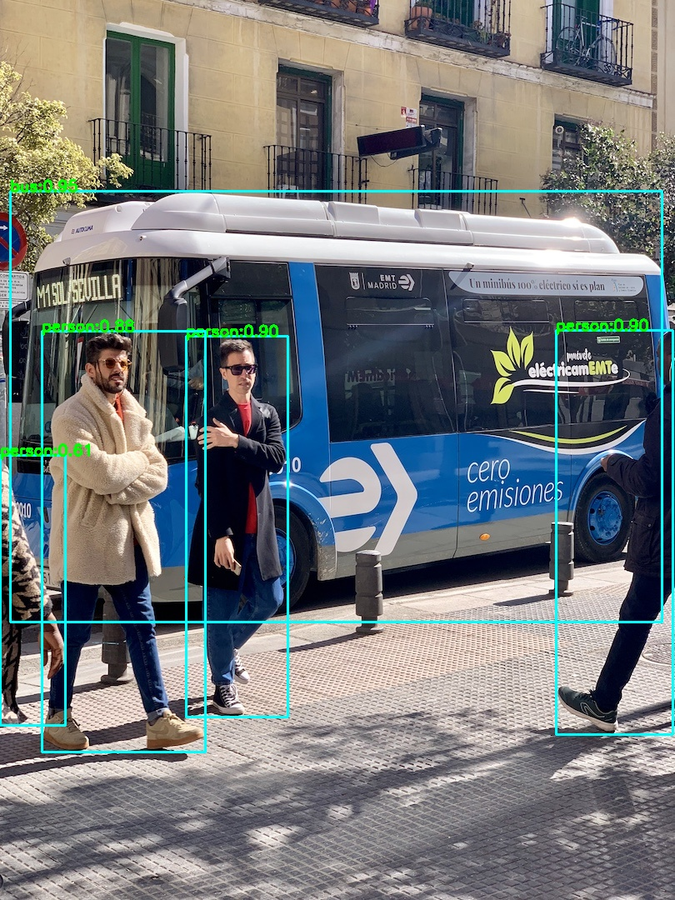

# Export ONNX Model

## Check requirements
```shell
pip install onnx>=1.10.0
```

## Export script
```shell
python ./deploy/ONNX/export_onnx.py \
    --weights yolov6s.pt \
    --img 640 \
    --batch 1
```


#### Description of all arguments

- `--weights` : The path of yolov6 model weights.
- `--img` : Image size of model inputs.
- `--batch` : Batch size of model inputs.
- `--half` : Whether to export half-precision model.
- `--inplace` : Whether to set Detect() inplace.
- `--simplify` : Whether to simplify onnx. Not support in end to end export.
- `--end2end` : Whether to export end to end onnx model. Only support onnxruntime and TensorRT >= 8.0.0 .
- `--with-preprocess` : Whether to export preprocess with bgr2rgb and normalize (divide by 255)
- `--max-wh` : Default is None for TensorRT backend. Set int for onnxruntime backend.
- `--topk-all` : Topk objects for every image.
- `--iou-thres` : IoU threshold for NMS algorithm.
- `--conf-thres` : Confidence threshold for NMS algorithm.
- `--device` : Export device. Cuda device : 0 or 0,1,2,3 ... , CPU : cpu .

## Download

* [YOLOv6-nano](https://github.com/meituan/YOLOv6/releases/download/0.1.0/yolov6n.onnx)
* [YOLOv6-tiny](https://github.com/meituan/YOLOv6/releases/download/0.1.0/yolov6t.onnx)
* [YOLOv6-s](https://github.com/meituan/YOLOv6/releases/download/0.1.0/yolov6s.onnx)

## End2End export

Now YOLOv6 supports end to end detect for onnxruntime and TensorRT !

If you want to deploy in TensorRT, make sure you have installed TensorRT >= 8.0.0 !

### onnxruntime backend
#### Usage

```bash
python ./deploy/ONNX/export_onnx.py \
    --weights yolov6s.pt \
    --img 640 \
    --batch 1 \
    --end2end \
    --max-wh 7680
```

You will get an onnx with **NonMaxSuppression** operater .

The onnx outputs shape is ```nums x 7```.

```nums``` means the number of all objects which were detected.

```7```  means [`batch_index`,`x0`,`y0`,`x1`,`y1`,`classid`,`score`]

### TensorRT backend (TensorRT version>= 8.0.0)

#### Usage

```bash
python ./deploy/ONNX/export_onnx.py \
    --weights yolov6s.pt \
    --img 640 \
    --batch 1 \
    --end2end
```

You will get an onnx with **[EfficientNMS_TRT](https://github.com/NVIDIA/TensorRT/tree/main/plugin/efficientNMSPlugin)** plugin .
The onnx outputs are as shown :


```num_dets``` means the number of object in every image in its batch .

```det_boxes``` means topk(100) object's location about [`x0`,`y0`,`x1`,`y1`] .

```det_scores``` means the confidence score of every topk(100) objects .

```det_classes``` means the category of every topk(100) objects .


You can export TensorRT engine use [trtexec](https://docs.nvidia.com/deeplearning/tensorrt/developer-guide/index.html#trtexec-ovr) tools.
#### Usage
``` shell
/path/to/trtexec \
    --onnx=yolov6s.onnx \
    --saveEngine=yolov6s.engine \
    --fp16 # if export TensorRT fp16 model
```

## Deploy YOLOv6 with ONNXRuntime in C++

### Prepare third-party libs and models.
* download the pre-built libs and converted models from [Baidu Drive](https://pan.baidu.com/s/1liMLKmq-9ds6r3Eyt93WCg), code: hi03
* or build the third_party libs from sources, [opencv](https://github.com/opencv/opencv) and [onnxruntime](https://github.com/microsoft/onnxruntime)

Put third_party libs into `third_party` dir and put the model files into `model` dir:  
```bash
ONNX git:(main) ✗ tree . -L 1     
.
├── CMakeLists.txt      # cmake
├── README.md
├── build               # build dir
├── build-debug.sh      # build script
├── export_onnx.py
├── main.cpp            # demo entry
├── model               # model files (*.onnx)
├── output.jpg          # output result
├── src                 # ORT C++ source codes
├── test.jpg            # source image
└── third_party         # third parties include and libs
```

### Check the main.cpp and CMakeLists.txt
You can write a simple main.cpp like:  
```c++
#include "yolov6.h"

static void test_yolov6()
{
  std::string onnx_path = "../model/yolov6s-640x640.onnx";
  std::string test_img_path = "../test.jpg";
  std::string save_img_path = "../output.jpg";

  auto yolov6_det = yolov6::create(onnx_path, 1); // 1 threads

  std::vector<yolov6::types::Boxf> detected_boxes;
  cv::Mat img_bgr = cv::imread(test_img_path);
  yolov6_det->detect(img_bgr, detected_boxes);

  yolov6::utils::draw_boxes_inplace(img_bgr, detected_boxes);

  cv::imwrite(save_img_path, img_bgr);

  std::cout << "Detected Boxes Num: " << detected_boxes.size() << std::endl;
}

int main(__unused int argc, __unused char *argv[])
{
  test_yolov6();
  return 0;
}
```
Future more, you can check the [CMakeLists.txt](CMakeLists.txt) for more details.

### Build YOLOv6
First, you can build the yolov6 c++ demo through (On Mac OSX and Linux)
```bash
cd ./deploy/ONNX 
sh ./build-debug.sh
```
On Linux, in order to link the prebuilt libs, you need to export `third_party/lib` to LD_LIBRARY_PATH first.
```shell
export LD_LIBRARY_PATH=YOUR-PATH-TO/third_party/lib:$LD_LIBRARY_PATH
export LIBRARY_PATH=YOUR-PATH-TO/third_party/lib:$LIBRARY_PATH  # (may need)
```
Some logs may look like:
```shell
Installing ONNXRuntime libs ...
-- Up-to-date: /Users/xxx/YOLOv6/deploy/ONNX/build/libonnxruntime.1.10.0.dylib
-- Up-to-date: /Users/xxx/YOLOv6/deploy/ONNX/build/libonnxruntime.dylib
Installed libs !
-- Configuring done
-- Generating done
-- Build files have been written to: /Users/xxx/YOLOv6/deploy/ONNX/build
Consolidate compiler generated dependencies of target yolov6
[100%] Built target yolov6
```
Then, run the yolov6 and check the output result.
```shell
cd build
./yolov6
➜  build git:(main) ✗ ./yolov6
YOLOV6_DEBUG LogId: ../model/yolov6s-640x640.onnx
=============== Input-Dims ==============
input_node_dims: 1
input_node_dims: 3
input_node_dims: 640
input_node_dims: 640
=============== Output-Dims ==============
Output: 0 Name: outputs Dim: 0 :1
Output: 0 Name: outputs Dim: 1 :8400
Output: 0 Name: outputs Dim: 2 :85
========================================
detected num_anchors: 8400
generate_bboxes num: 47
Detected Boxes Num: 5
[MEM DELETE] BasicOrtHandler done!
```
The output is:
<div align='center'>
  
  
</div>  

### How to convert YOLOv6 to other format ?
Documents about how to convert YOLOv6 to NCNN/MNN/TNN/ONNX formats, please check:  
* [知乎文章：🤓YOLOv6 ORT/MNN/TNN/NCNN C++推理部署](https://zhuanlan.zhihu.com/p/533643238)

### Reference
This code is heavily based on [lite.ai.toolkit](https://github.com/DefTruth/lite.ai.toolkit) from [DefTruth](https://github.com/DefTruth)