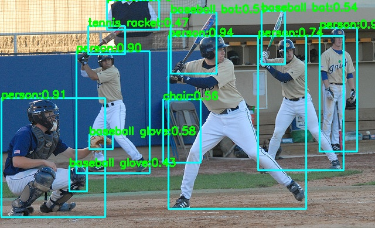

# YOLOv6 in NCNN

This tutorial explains how to convert a YOLOv6 model into the [NCNN](https://github.com/Tencent/ncnn) format, as well as some common issues that may arise during the conversion process. This tutorial covers packaging and debugging in the [lite.ai.toolkit](https://github.com/DefTruth/lite.ai.toolkit) platform on the macOS environment.

## 0. Prepare Environment

There are currently two paths to convert a model to the NCNN format: the first path is from PyTorch to ONNX to NCNN, and the second path is from PyTorch to TorchScript to ONNX to NCNN.
* First path: Build [NCNN](https://github.com/Tencent/ncnn)
* Second path: Build [NCNN](https://github.com/Tencent/ncnn) and [PNNX](https://github.com/Tencent/ncnn/tree/master/tools/pnnx). If you don't want to build PNNX, maybe have a try: [PNNX releases](https://github.com/pnnx/pnnx/releases)

## 1. Prepare something else

* Prepare the original .pt file under the ./path/to/yolov6 directory.

* (Path 2)Prepare the export_pt.py file under the ./path/to/yolov6/deploy directory. And you should modify the code as the following tutorial.

## 2. Convert

#### 2.1 ONNX-->NCNN path

* Export ONNX model as following command:

```shell
python deploy/ONNX/export_onnx.py --weights ./path/to/yolov6s.pt --device 0 --simplify --batch [1 or 32]
```

* Use the onnx2ncnn tool to convert the ONNX model to NCNN format:

```shell
./onnx2ncnn ./path/to/yolov6s.onnx ./path/to/save/yolov6s.param /path/to/save/yolov6s.bin
```

#### 2.2 PNNX-->NCNN path

* Modify the export_pt.py as follow
<details>
    <summary>Show/Hide export.py</summary>

    #!/usr/bin/env python3
    # -*- coding:utf-8 -*-
    import argparse
    import sys
    import os
    import torch
    import torch.nn as nn

    ROOT = os.getcwd()
    if str(ROOT) not in sys.path:
        sys.path.append(str(ROOT))

    from yolov6.models.yolo import *
    from yolov6.models.effidehead import Detect
    from yolov6.layers.common import *
    from yolov6.utils.events import LOGGER
    from yolov6.utils.checkpoint import load_checkpoint

    if __name__ == '__main__':
        parser = argparse.ArgumentParser()
        parser.add_argument('--weights', type=str, default='./yolov6s.pt', help='weights path')
        parser.add_argument('--half', action='store_true', help='FP16 half-precision export')
        parser.add_argument('--device', default='cpu', help='cuda device, i.e. 0 or 0,1,2,3 or cpu')
        parser.add_argument('--inplace', action='store_true', help='set Detect() inplace=True')
        args = parser.parse_args()
        print(args)

        cuda = args.device != 'cpu' and torch.cuda.is_available()
        device = torch.device(f'cuda:{args.device}' if cuda else 'cpu')
        assert not (device.type == 'cpu' and args.half), '--half only compatible with GPU export, i.e. use --device 0'
        model = load_checkpoint(args.weights, map_location=device, inplace=True, fuse=True)  # load FP32 model
        for layer in model.modules():
            if isinstance(layer, RepVGGBlock):
                layer.switch_to_deploy()

        if args.half:
            model = model.half()
        model.eval()
        for k, m in model.named_modules():
            if isinstance(m, Conv):
                if isinstance(m.act, nn.SiLU):
                    m.act = SiLU()
            elif isinstance(m, Detect):
                m.inplace = args.inplace

        x = torch.rand(1, 3, 512, 512)
        mod = torch.jit.trace(model, x)
        mod.save("your_filename.pt")
</details>
<br>

* Then, run the export_pt.py in shell

```shell
python ./path/to/yolov6/deploy/export_pt.py --weights ./path/to/yolov6s.pt
```
The above code throws an error that it cannot output a List. To fix this, modify the forward function of the Model in yolov6/models/yolo.py to return x only if export_mode is True, otherwise return a List [x, featmaps].

* Copy the generated new .pt file to the directory where the pnnx script is located, and then execute following command.

```shell
./path/to/pnnx ./path/to/generate.pt inputshape=[1,3,640,640] #windows
./path/to/pnnx ./path/to/generate.pt inputshape="[1,3,640,640]" #mac and linux
```

## 3. Modify ncnn file
In most versions of ncnn, there are some issues with directly generating ncnn as mentioned above, manifested as xywh being all 0 or random numbers. This is because some versions of ncnn have problems with broadcast multiplication, which requires modifying the param file.

- Open *.param and find the parameter name that corresponds to the output of the last Mul operator and the first input.

- Change the output corresponding to the last concat operation's first input from the output mentioned in a to the first input.

<details>
    <summary>Show/Hide modified.param</summary>

    #The parameter names corresponding to the output of step a and the first input are 182 (output) and 180 (first input) on line 162.
    #The specific operation of step b is to change 182 to 180 in line 165.
    7767517
    163 186
    Input                    in0                      0 1 in0
    Convolution              convrelu_0               1 1 in0 1 0=16 1=3 11=3 12=1 13=2 14=1 2=1 3=2 4=1 5=1 6=432 9=1
    Convolution              convrelu_1               1 1 1 2 0=32 1=3 11=3 12=1 13=2 14=1 2=1 3=2 4=1 5=1 6=4608 9=1
    Convolution              convrelu_2               1 1 2 3 0=32 1=3 11=3 12=1 13=1 14=1 2=1 3=1 4=1 5=1 6=9216 9=1
    Convolution              convrelu_3               1 1 3 4 0=32 1=3 11=3 12=1 13=1 14=1 2=1 3=1 4=1 5=1 6=9216 9=1
    Split                    splitncnn_0              1 2 4 5 6
    Convolution              convrelu_4               1 1 6 7 0=64 1=3 11=3 12=1 13=2 14=1 2=1 3=2 4=1 5=1 6=18432 9=1
    Convolution              convrelu_5               1 1 7 8 0=64 1=3 11=3 12=1 13=1 14=1 2=1 3=1 4=1 5=1 6=36864 9=1
    Convolution              convrelu_6               1 1 8 9 0=64 1=3 11=3 12=1 13=1 14=1 2=1 3=1 4=1 5=1 6=36864 9=1
    Convolution              convrelu_7               1 1 9 10 0=64 1=3 11=3 12=1 13=1 14=1 2=1 3=1 4=1 5=1 6=36864 9=1
    Convolution              convrelu_8               1 1 10 11 0=64 1=3 11=3 12=1 13=1 14=1 2=1 3=1 4=1 5=1 6=36864 9=1
    Split                    splitncnn_1              1 3 11 12 13 14
    Convolution              convrelu_9               1 1 14 15 0=128 1=3 11=3 12=1 13=2 14=1 2=1 3=2 4=1 5=1 6=73728 9=1
    Convolution              convrelu_10              1 1 15 16 0=128 1=3 11=3 12=1 13=1 14=1 2=1 3=1 4=1 5=1 6=147456 9=1
    Convolution              convrelu_11              1 1 16 17 0=128 1=3 11=3 12=1 13=1 14=1 2=1 3=1 4=1 5=1 6=147456 9=1
    Convolution              convrelu_12              1 1 17 18 0=128 1=3 11=3 12=1 13=1 14=1 2=1 3=1 4=1 5=1 6=147456 9=1
    Convolution              convrelu_13              1 1 18 19 0=128 1=3 11=3 12=1 13=1 14=1 2=1 3=1 4=1 5=1 6=147456 9=1
    Convolution              convrelu_14              1 1 19 20 0=128 1=3 11=3 12=1 13=1 14=1 2=1 3=1 4=1 5=1 6=147456 9=1
    Convolution              convrelu_15              1 1 20 21 0=128 1=3 11=3 12=1 13=1 14=1 2=1 3=1 4=1 5=1 6=147456 9=1
    Split                    splitncnn_2              1 3 21 22 23 24
    Convolution              convrelu_16              1 1 24 25 0=192 1=3 11=3 12=1 13=2 14=1 2=1 3=2 4=1 5=1 6=221184 9=1
    Convolution              convrelu_17              1 1 25 26 0=192 1=3 11=3 12=1 13=1 14=1 2=1 3=1 4=1 5=1 6=331776 9=1
    Convolution              convrelu_18              1 1 26 27 0=192 1=3 11=3 12=1 13=1 14=1 2=1 3=1 4=1 5=1 6=331776 9=1
    Split                    splitncnn_3              1 2 27 28 29
    Convolution              convrelu_19              1 1 29 30 0=256 1=3 11=3 12=1 13=2 14=1 2=1 3=2 4=1 5=1 6=442368 9=1
    Convolution              convrelu_20              1 1 30 31 0=256 1=3 11=3 12=1 13=1 14=1 2=1 3=1 4=1 5=1 6=589824 9=1
    Convolution              convrelu_21              1 1 31 32 0=256 1=3 11=3 12=1 13=1 14=1 2=1 3=1 4=1 5=1 6=589824 9=1
    Split                    splitncnn_4              1 2 32 33 34
    Convolution              convrelu_22              1 1 34 35 0=128 1=1 11=1 12=1 13=1 14=0 2=1 3=1 4=0 5=1 6=32768 9=1
    Convolution              convrelu_23              1 1 35 36 0=128 1=3 11=3 12=1 13=1 14=1 2=1 3=1 4=1 5=1 6=147456 9=1
    Convolution              convrelu_24              1 1 36 37 0=128 1=1 11=1 12=1 13=1 14=0 2=1 3=1 4=0 5=1 6=16384 9=1
    Split                    splitncnn_5              1 2 37 38 39
    Pooling                  maxpool2d_110            1 1 39 40 0=0 1=5 11=5 12=1 13=2 2=1 3=2 5=1
    Split                    splitncnn_6              1 2 40 41 42
    Pooling                  maxpool2d_111            1 1 42 43 0=0 1=5 11=5 12=1 13=2 2=1 3=2 5=1
    Split                    splitncnn_7              1 2 43 44 45
    Pooling                  maxpool2d_112            1 1 45 46 0=0 1=5 11=5 12=1 13=2 2=1 3=2 5=1
    Concat                   cat_0                    4 1 38 41 44 46 47 0=0
    Convolution              convrelu_27              1 1 33 48 0=128 1=1 11=1 12=1 13=1 14=0 2=1 3=1 4=0 5=1 6=32768 9=1
    Convolution              convrelu_25              1 1 47 49 0=128 1=1 11=1 12=1 13=1 14=0 2=1 3=1 4=0 5=1 6=65536 9=1
    Convolution              convrelu_26              1 1 49 50 0=128 1=3 11=3 12=1 13=1 14=1 2=1 3=1 4=1 5=1 6=147456 9=1
    Concat                   cat_1                    2 1 48 50 51 0=0
    Convolution              convrelu_28              1 1 51 52 0=256 1=1 11=1 12=1 13=1 14=0 2=1 3=1 4=0 5=1 6=65536 9=1
    Convolution              convrelu_30              1 1 52 53 0=128 1=1 11=1 12=1 13=1 14=0 2=1 3=1 4=0 5=1 6=32768 9=1
    Split                    splitncnn_8              1 2 53 54 55
    Deconvolution            deconv_107               1 1 55 56 0=128 1=2 11=2 12=1 13=2 14=0 18=0 19=0 2=1 3=2 4=0 5=1 6=65536
    Convolution              convrelu_32              1 1 28 57 0=128 1=1 11=1 12=1 13=1 14=0 2=1 3=1 4=0 5=1 6=24576 9=1
    Convolution              convrelu_29              1 1 23 58 0=128 1=1 11=1 12=1 13=1 14=0 2=1 3=1 4=0 5=1 6=16384 9=1
    Convolution              convrelu_31              1 1 58 59 0=128 1=3 11=3 12=1 13=2 14=1 2=1 3=2 4=1 5=1 6=147456 9=1
    Concat                   cat_2                    3 1 56 57 59 60 0=0
    Convolution              convrelu_33              1 1 60 61 0=128 1=1 11=1 12=1 13=1 14=0 2=1 3=1 4=0 5=1 6=49152 9=1
    Convolution              convrelu_34              1 1 61 62 0=128 1=3 11=3 12=1 13=1 14=1 2=1 3=1 4=1 5=1 6=147456 9=1
    Convolution              convrelu_35              1 1 62 63 0=128 1=3 11=3 12=1 13=1 14=1 2=1 3=1 4=1 5=1 6=147456 9=1
    Convolution              convrelu_36              1 1 63 64 0=128 1=3 11=3 12=1 13=1 14=1 2=1 3=1 4=1 5=1 6=147456 9=1
    Convolution              convrelu_37              1 1 64 65 0=128 1=3 11=3 12=1 13=1 14=1 2=1 3=1 4=1 5=1 6=147456 9=1
    Convolution              convrelu_39              1 1 65 66 0=64 1=1 11=1 12=1 13=1 14=0 2=1 3=1 4=0 5=1 6=8192 9=1
    Split                    splitncnn_9              1 2 66 67 68
    Deconvolution            deconv_108               1 1 68 69 0=64 1=2 11=2 12=1 13=2 14=0 18=0 19=0 2=1 3=2 4=0 5=1 6=16384
    Convolution              convrelu_41              1 1 22 70 0=64 1=1 11=1 12=1 13=1 14=0 2=1 3=1 4=0 5=1 6=8192 9=1
    Convolution              convrelu_38              1 1 13 71 0=64 1=1 11=1 12=1 13=1 14=0 2=1 3=1 4=0 5=1 6=4096 9=1
    Convolution              convrelu_40              1 1 71 72 0=64 1=3 11=3 12=1 13=2 14=1 2=1 3=2 4=1 5=1 6=36864 9=1
    Concat                   cat_3                    3 1 69 70 72 73 0=0
    Convolution              convrelu_42              1 1 73 74 0=64 1=1 11=1 12=1 13=1 14=0 2=1 3=1 4=0 5=1 6=12288 9=1
    Convolution              convrelu_43              1 1 74 75 0=64 1=3 11=3 12=1 13=1 14=1 2=1 3=1 4=1 5=1 6=36864 9=1
    Convolution              convrelu_44              1 1 75 76 0=64 1=3 11=3 12=1 13=1 14=1 2=1 3=1 4=1 5=1 6=36864 9=1
    Convolution              convrelu_45              1 1 76 77 0=64 1=3 11=3 12=1 13=1 14=1 2=1 3=1 4=1 5=1 6=36864 9=1
    Convolution              convrelu_46              1 1 77 78 0=64 1=3 11=3 12=1 13=1 14=1 2=1 3=1 4=1 5=1 6=36864 9=1
    Convolution              convrelu_48              1 1 78 79 0=32 1=1 11=1 12=1 13=1 14=0 2=1 3=1 4=0 5=1 6=2048 9=1
    Split                    splitncnn_10             1 2 79 80 81
    Deconvolution            deconv_109               1 1 81 82 0=32 1=2 11=2 12=1 13=2 14=0 18=0 19=0 2=1 3=2 4=0 5=1 6=4096
    Convolution              convrelu_50              1 1 12 83 0=32 1=1 11=1 12=1 13=1 14=0 2=1 3=1 4=0 5=1 6=2048 9=1
    Convolution              convrelu_47              1 1 5 84 0=32 1=1 11=1 12=1 13=1 14=0 2=1 3=1 4=0 5=1 6=1024 9=1
    Convolution              convrelu_49              1 1 84 85 0=32 1=3 11=3 12=1 13=2 14=1 2=1 3=2 4=1 5=1 6=9216 9=1
    Concat                   cat_4                    3 1 82 83 85 86 0=0
    Convolution              convrelu_51              1 1 86 87 0=32 1=1 11=1 12=1 13=1 14=0 2=1 3=1 4=0 5=1 6=3072 9=1
    Convolution              convrelu_52              1 1 87 88 0=32 1=3 11=3 12=1 13=1 14=1 2=1 3=1 4=1 5=1 6=9216 9=1
    Convolution              convrelu_53              1 1 88 89 0=32 1=3 11=3 12=1 13=1 14=1 2=1 3=1 4=1 5=1 6=9216 9=1
    Convolution              convrelu_54              1 1 89 90 0=32 1=3 11=3 12=1 13=1 14=1 2=1 3=1 4=1 5=1 6=9216 9=1
    Convolution              convrelu_55              1 1 90 91 0=32 1=3 11=3 12=1 13=1 14=1 2=1 3=1 4=1 5=1 6=9216 9=1
    Split                    splitncnn_11             1 2 91 92 93
    Convolution              convrelu_56              1 1 93 94 0=32 1=3 11=3 12=1 13=2 14=1 2=1 3=2 4=1 5=1 6=9216 9=1
    Concat                   cat_5                    2 1 94 80 95 0=0
    Convolution              convrelu_57              1 1 95 96 0=64 1=3 11=3 12=1 13=1 14=1 2=1 3=1 4=1 5=1 6=36864 9=1
    Convolution              convrelu_58              1 1 96 97 0=64 1=3 11=3 12=1 13=1 14=1 2=1 3=1 4=1 5=1 6=36864 9=1
    Convolution              convrelu_59              1 1 97 98 0=64 1=3 11=3 12=1 13=1 14=1 2=1 3=1 4=1 5=1 6=36864 9=1
    Convolution              convrelu_60              1 1 98 99 0=64 1=3 11=3 12=1 13=1 14=1 2=1 3=1 4=1 5=1 6=36864 9=1
    Split                    splitncnn_12             1 2 99 100 101
    Convolution              convrelu_61              1 1 101 102 0=64 1=3 11=3 12=1 13=2 14=1 2=1 3=2 4=1 5=1 6=36864 9=1
    Concat                   cat_6                    2 1 102 67 103 0=0
    Convolution              convrelu_62              1 1 103 104 0=128 1=3 11=3 12=1 13=1 14=1 2=1 3=1 4=1 5=1 6=147456 9=1
    Convolution              convrelu_63              1 1 104 105 0=128 1=3 11=3 12=1 13=1 14=1 2=1 3=1 4=1 5=1 6=147456 9=1
    Convolution              convrelu_64              1 1 105 106 0=128 1=3 11=3 12=1 13=1 14=1 2=1 3=1 4=1 5=1 6=147456 9=1
    Convolution              convrelu_65              1 1 106 107 0=128 1=3 11=3 12=1 13=1 14=1 2=1 3=1 4=1 5=1 6=147456 9=1
    Split                    splitncnn_13             1 2 107 108 109
    Convolution              convrelu_66              1 1 109 110 0=128 1=3 11=3 12=1 13=2 14=1 2=1 3=2 4=1 5=1 6=147456 9=1
    Concat                   cat_7                    2 1 110 54 111 0=0
    Convolution              conv_87                  1 1 92 112 0=32 1=1 11=1 12=1 13=1 14=0 2=1 3=1 4=0 5=1 6=1024
    Swish                    silu_4                   1 1 112 113
    Split                    splitncnn_14             1 2 113 114 115
    Convolution              conv_88                  1 1 115 116 0=32 1=3 11=3 12=1 13=1 14=1 2=1 3=1 4=1 5=1 6=9216
    Swish                    silu_5                   1 1 116 117
    Convolution              conv_90                  1 1 114 118 0=32 1=3 11=3 12=1 13=1 14=1 2=1 3=1 4=1 5=1 6=9216
    Swish                    silu_6                   1 1 118 119
    Convolution              conv_92                  1 1 100 120 0=64 1=1 11=1 12=1 13=1 14=0 2=1 3=1 4=0 5=1 6=4096
    Swish                    silu_7                   1 1 120 121
    Split                    splitncnn_15             1 2 121 122 123
    Convolution              conv_93                  1 1 123 124 0=64 1=3 11=3 12=1 13=1 14=1 2=1 3=1 4=1 5=1 6=36864
    Swish                    silu_8                   1 1 124 125
    Convolution              conv_95                  1 1 122 126 0=64 1=3 11=3 12=1 13=1 14=1 2=1 3=1 4=1 5=1 6=36864
    Swish                    silu_9                   1 1 126 127
    Convolution              conv_97                  1 1 108 128 0=128 1=1 11=1 12=1 13=1 14=0 2=1 3=1 4=0 5=1 6=16384
    Swish                    silu_10                  1 1 128 129
    Split                    splitncnn_16             1 2 129 130 131
    Convolution              conv_98                  1 1 131 132 0=128 1=3 11=3 12=1 13=1 14=1 2=1 3=1 4=1 5=1 6=147456
    Swish                    silu_11                  1 1 132 133
    Convolution              conv_100                 1 1 130 134 0=128 1=3 11=3 12=1 13=1 14=1 2=1 3=1 4=1 5=1 6=147456
    Swish                    silu_12                  1 1 134 135
    Convolution              convrelu_67              1 1 111 136 0=256 1=3 11=3 12=1 13=1 14=1 2=1 3=1 4=1 5=1 6=589824 9=1
    Convolution              convrelu_68              1 1 136 137 0=256 1=3 11=3 12=1 13=1 14=1 2=1 3=1 4=1 5=1 6=589824 9=1
    Convolution              convrelu_69              1 1 137 138 0=256 1=3 11=3 12=1 13=1 14=1 2=1 3=1 4=1 5=1 6=589824 9=1
    Convolution              convrelu_70              1 1 138 139 0=256 1=3 11=3 12=1 13=1 14=1 2=1 3=1 4=1 5=1 6=589824 9=1
    Convolution              conv_102                 1 1 139 140 0=256 1=1 11=1 12=1 13=1 14=0 2=1 3=1 4=0 5=1 6=65536
    Swish                    silu_13                  1 1 140 141
    Split                    splitncnn_17             1 2 141 142 143
    Convolution              conv_103                 1 1 143 144 0=256 1=3 11=3 12=1 13=1 14=1 2=1 3=1 4=1 5=1 6=589824
    Swish                    silu_14                  1 1 144 145
    Convolution              conv_105                 1 1 142 146 0=256 1=3 11=3 12=1 13=1 14=1 2=1 3=1 4=1 5=1 6=589824
    Swish                    silu_15                  1 1 146 147
    Convolution              convsigmoid_74           1 1 117 148 0=80 1=1 11=1 12=1 13=1 14=0 2=1 3=1 4=0 5=1 6=2560 9=4
    Reshape                  reshape_187              1 1 148 149 0=4096 1=80
    Convolution              convsigmoid_73           1 1 125 150 0=80 1=1 11=1 12=1 13=1 14=0 2=1 3=1 4=0 5=1 6=5120 9=4
    Reshape                  reshape_186              1 1 150 151 0=1024 1=80
    Convolution              convsigmoid_72           1 1 133 152 0=80 1=1 11=1 12=1 13=1 14=0 2=1 3=1 4=0 5=1 6=10240 9=4
    Reshape                  reshape_185              1 1 152 153 0=256 1=80
    Convolution              convsigmoid_71           1 1 145 154 0=80 1=1 11=1 12=1 13=1 14=0 2=1 3=1 4=0 5=1 6=20480 9=4
    Reshape                  reshape_184              1 1 154 155 0=64 1=80
    Concat                   cat_8                    4 1 149 151 153 155 156 0=1
    Convolution              conv_106                 1 1 147 157 0=4 1=1 11=1 12=1 13=1 14=0 2=1 3=1 4=0 5=1 6=1024
    Convolution              conv_101                 1 1 135 158 0=4 1=1 11=1 12=1 13=1 14=0 2=1 3=1 4=0 5=1 6=512
    Convolution              conv_96                  1 1 127 159 0=4 1=1 11=1 12=1 13=1 14=0 2=1 3=1 4=0 5=1 6=256
    Convolution              conv_91                  1 1 119 160 0=4 1=1 11=1 12=1 13=1 14=0 2=1 3=1 4=0 5=1 6=128
    Reshape                  reshape_191              1 1 160 161 0=4096 1=4
    Reshape                  reshape_190              1 1 159 162 0=1024 1=4
    Reshape                  reshape_189              1 1 158 163 0=256 1=4
    Reshape                  reshape_188              1 1 157 164 0=64 1=4
    Concat                   cat_9                    4 1 161 162 163 164 165 0=1
    Permute                  permute_192              1 1 165 166 0=1
    Slice                    split_0                  1 2 166 167 168 -23300=2,2,-233 1=1
    MemoryData               pnnx_fold_anchor_points.1 0 1 169 0=2 1=5440
    MemoryData               pnnx_fold_anchor_points.1_1 0 1 170 0=2 1=5440
    BinaryOp                 sub_0                    2 1 169 167 171 0=1
    Split                    splitncnn_18             1 2 171 172 173
    BinaryOp                 add_1                    2 1 170 168 174 0=0
    Split                    splitncnn_19             1 2 174 175 176
    BinaryOp                 add_2                    2 1 172 175 177 0=0
    BinaryOp                 div_3                    1 1 177 178 0=3 1=1 2=2.000000e+00
    BinaryOp                 sub_4                    2 1 176 173 179 0=1
    Concat                   cat_10                   2 1 178 179 180 0=1
    MemoryData               pnnx_fold_stride_tensor.1 0 1 181 0=1 1=5440
    BinaryOp                 mul_5                    2 1 180 181 182 0=2
    MemoryData               pnnx_fold_925            0 1 183 0=1 1=5440
    Permute                  permute_193              1 1 156 184 0=1
    Concat                   cat_11                   3 1 180 183 184 out0 0=1
    #origin : Concat                   cat_11                   3 1 182 183 184 out0 0=1
</details>
<br>
This modification means that some operations in the head need to be added to the post-processing of the used framework. Next, we will use lite.ai.toolkit as an example to explain.

* Modify ./path/to/lite.ai.Toolkit/examples/lite/cv/test_lite_yolov6.cpp as

<details>
    <summary>Show/Hide test_lite_yolov6.cpp</summary>
    //
    // Created by DefTruth on 2022/6/25.
    //

    #include "lite/lite.h"

    static void test_onnxruntime(std::string onnx)//保留onnx对比下效果，如果要更换onnx模型需更改onnx对应的头文件与代码
    {
    #ifdef ENABLE_ONNXRUNTIME
    std::string onnx_path = "../../../hub/onnx/cv/" + onnx;
    std::string test_img_path = "../../../examples/lite/resources/test_lite_yolov5_2.jpg";//切换为测试图片路径
    std::string save_img_path = "../../../logs/test_oxr_yolov6_1.jpg";

    // 2. Test Specific Engine ONNXRuntime
    lite::onnxruntime::cv::detection::YOLOv6 *yolov6 =
        new lite::onnxruntime::cv::detection::YOLOv6(onnx_path);

    std::vector<lite::types::Boxf> detected_boxes;
    cv::Mat img_bgr = cv::imread(test_img_path);
    yolov6->detect(img_bgr, detected_boxes, 0.5);

    lite::utils::draw_boxes_inplace(img_bgr, detected_boxes);

    cv::imwrite(save_img_path, img_bgr);

    std::cout << "ONNXRuntime Version Detected Boxes Num: " << detected_boxes.size() << std::endl;

    delete yolov6;
    #endif
    }

    static void test_ncnn(std::string ncnn_param, std::string ncnn_bin)
    {
    #ifdef ENABLE_NCNN
    std::string param_path = "../../../hub/ncnn/cv/" + ncnn_param;
    std::string bin_path = "../../../hub/ncnn/cv/" + ncnn_bin;
    std::string test_img_path = "../../../examples/lite/resources/test_lite_yolov5_2.jpg"; //切换为测试图片路径
    std::string save_img_path = "../../../logs/test_ncnn_yolov6_2.jpg";

    // 4. Test Specific Engine NCNN
    lite::ncnn::cv::detection::YOLOv6 *yolov6 =
        new lite::ncnn::cv::detection::YOLOv6(param_path, bin_path);

    std::vector<lite::types::Boxf> detected_boxes;
    cv::Mat img_bgr = cv::imread(test_img_path);
    yolov6->detect(img_bgr, detected_boxes);

    lite::utils::draw_boxes_inplace(img_bgr, detected_boxes);

    cv::imwrite(save_img_path, img_bgr);

    std::cout << "NCNN Version Detected Boxes Num: " << detected_boxes.size() << std::endl;

    delete yolov6;
    #endif
    }

    static void test_lite(std::string onnx, std::string ncnn_param, std::string ncnn_bin)
    {
    test_onnxruntime(onnx);
    test_ncnn(ncnn_param, ncnn_bin);
    }

    int main(__unused int argc, __unused char *argv[])
    {
    std::string onnx = argv[1];
    std::string ncnn_param = argv[2];
    std::string ncnn_bin = argv[3];
    test_lite(onnx, ncnn_param, ncnn_bin);
    return 0;
    }
</details>
<br>
* Modify ./path/to/lite.ai.Toolkit/lite/ncnn/cv/ncnn_yolov6.h Line 28-29 to the input resolution of the ncnn model.

<details>
    <summary>Show/Hide ncnn_yolov6.h</summary>

    //
    // Created by DefTruth on 2022/6/25.
    //

    #ifndef LITE_AI_TOOLKIT_NCNN_CV_NCNN_YOLOV6_H
    #define LITE_AI_TOOLKIT_NCNN_CV_NCNN_YOLOV6_H

    #include "lite/ncnn/core/ncnn_core.h"

    namespace ncnncv
    {
    class LITE_EXPORTS NCNNYOLOv6
    {
    private:
        ncnn::Net *net = nullptr;
        const char *log_id = nullptr;
        const char *param_path = nullptr;
        const char *bin_path = nullptr;
        std::vector<const char *> input_names;
        std::vector<const char *> output_names;
        std::vector<int> input_indexes;
        std::vector<int> output_indexes;

    public:
        explicit NCNNYOLOv6(const std::string &_param_path,
                            const std::string &_bin_path,
                            unsigned int _num_threads = 1,
                            int _input_height = 512,
                            int _input_width = 512); //
        ~NCNNYOLOv6();

    private:
        // nested classes
        typedef struct GridAndStride
        {
        int grid0;
        int grid1;
        int stride;
        } YOLOv6Anchor;

        typedef struct
        {
        float r;
        int dw;
        int dh;
        int new_unpad_w;
        int new_unpad_h;
        bool flag;
        } YOLOv6ScaleParams;

    private:
        const unsigned int num_threads; // initialize at runtime.
        const int input_height; // 640/320
        const int input_width; // 640/320

        const char *class_names[80] = {
            "person", "bicycle", "car", "motorcycle", "airplane", "bus", "train", "truck", "boat", "traffic light",
            "fire hydrant", "stop sign", "parking meter", "bench", "bird", "cat", "dog", "horse", "sheep", "cow",
            "elephant", "bear", "zebra", "giraffe", "backpack", "umbrella", "handbag", "tie", "suitcase", "frisbee",
            "skis", "snowboard", "sports ball", "kite", "baseball bat", "baseball glove", "skateboard", "surfboard",
            "tennis racket", "bottle", "wine glass", "cup", "fork", "knife", "spoon", "bowl", "banana", "apple",
            "sandwich", "orange", "broccoli", "carrot", "hot dog", "pizza", "donut", "cake", "chair", "couch",
            "potted plant", "bed", "dining table", "toilet", "tv", "laptop", "mouse", "remote", "keyboard",
            "cell phone", "microwave", "oven", "toaster", "sink", "refrigerator", "book", "clock", "vase",
            "scissors", "teddy bear", "hair drier", "toothbrush"
        };
        enum NMS
        {
        HARD = 0, BLEND = 1, OFFSET = 2
        };
        const float mean_vals[3] = {0.f, 0.f, 0.f}; // RGB
        const float norm_vals[3] = {1.0 / 255.f, 1.0 / 255.f, 1.0 / 255.f};
        static constexpr const unsigned int max_nms = 30000;

    protected:
        NCNNYOLOv6(const NCNNYOLOv6 &) = delete; //
        NCNNYOLOv6(NCNNYOLOv6 &&) = delete; //
        NCNNYOLOv6 &operator=(const NCNNYOLOv6 &) = delete; //
        NCNNYOLOv6 &operator=(NCNNYOLOv6 &&) = delete; //

    private:
        void print_debug_string();

        void transform(const cv::Mat &mat_rs, ncnn::Mat &in);

        void resize_unscale(const cv::Mat &mat,
                            cv::Mat &mat_rs,
                            int target_height,
                            int target_width,
                            YOLOv6ScaleParams &scale_params);

        void generate_anchors(const int target_height,
                            const int target_width,
                            std::vector<int> &strides,
                            std::vector<YOLOv6Anchor> &anchors);

        void generate_bboxes(const YOLOv6ScaleParams &scale_params,
                            std::vector<types::Boxf> &bbox_collection,
                            ncnn::Extractor &extractor,
                            float score_threshold, int img_height,
                            int img_width); // rescale & exclude

        void nms(std::vector<types::Boxf> &input, std::vector<types::Boxf> &output,
                float iou_threshold, unsigned int topk, unsigned int nms_type);

    public:
        void detect(const cv::Mat &mat, std::vector<types::Boxf> &detected_boxes,
                    float score_threshold = 0.5f, float iou_threshold = 0.45f,
                    unsigned int topk = 100, unsigned int nms_type = NMS::OFFSET);
    };
    }

    #endif //LITE_AI_TOOLKIT_NCNN_CV_NCNN_YOLOV6_H
</details>
<br>
* Modify ./path/to/lite.ai.Toolkit/lite/ncnn/cv/ncnn_yolov6.cpp

<details>
    <summary>Show/Hide ncnn_yolov6.cpp</summary>

    //
    // Created by DefTruth on 2022/6/25.
    //

    #include "ncnn_yolov6.h"
    #include "lite/utils.h"

    using ncnncv::NCNNYOLOv6;


    NCNNYOLOv6::NCNNYOLOv6(const std::string &_param_path,
                        const std::string &_bin_path,
                        unsigned int _num_threads,
                        int _input_height,
                        int _input_width) :
        log_id(_param_path.data()), param_path(_param_path.data()),
        bin_path(_bin_path.data()), num_threads(_num_threads),
        input_height(_input_height), input_width(_input_width)
    {
    net = new ncnn::Net();
    // init net, change this setting for better performance.
    net->opt.use_fp16_arithmetic = false;
    net->opt.use_vulkan_compute = false; // default
    // setup Focus in yolov5
    // net->register_custom_layer("YoloV5Focus", YoloV5Focus_layer_creator);
    net->load_param(param_path);
    net->load_model(bin_path);
    #ifdef LITENCNN_DEBUG
    this->print_debug_string();
    #endif
    }

    NCNNYOLOv6::~NCNNYOLOv6()
    {
    if (net) delete net;
    net = nullptr;
    }

    void NCNNYOLOv6::transform(const cv::Mat &mat_rs, ncnn::Mat &in)
    {
    // BGR NHWC -> RGB NCHW
    in = ncnn::Mat::from_pixels(mat_rs.data, ncnn::Mat::PIXEL_BGR2RGB, input_width, input_height);
    in.substract_mean_normalize(mean_vals, norm_vals);
    }

    // letterbox
    void NCNNYOLOv6::resize_unscale(const cv::Mat &mat, cv::Mat &mat_rs,
                                    int target_height, int target_width,
                                    YOLOv6ScaleParams &scale_params)
    {
    if (mat.empty()) return;
    int img_height = static_cast<int>(mat.rows);
    int img_width = static_cast<int>(mat.cols);

    mat_rs = cv::Mat(target_height, target_width, CV_8UC3,
                    cv::Scalar(114, 114, 114));
    // scale ratio (new / old) new_shape(h,w)
    float w_r = (float) target_width / (float) img_width;
    float h_r = (float) target_height / (float) img_height;
    float r = std::min(w_r, h_r);
    // compute padding
    int new_unpad_w = static_cast<int>((float) img_width * r); // floor
    int new_unpad_h = static_cast<int>((float) img_height * r); // floor
    int pad_w = target_width - new_unpad_w; // >=0
    int pad_h = target_height - new_unpad_h; // >=0

    int dw = pad_w / 2;
    int dh = pad_h / 2;

    // resize with unscaling
    cv::Mat new_unpad_mat;
    // cv::Mat new_unpad_mat = mat.clone(); // may not need clone.
    cv::resize(mat, new_unpad_mat, cv::Size(new_unpad_w, new_unpad_h));
    new_unpad_mat.copyTo(mat_rs(cv::Rect(dw, dh, new_unpad_w, new_unpad_h)));

    // record scale params.
    scale_params.r = r;
    scale_params.dw = dw;
    scale_params.dh = dh;
    scale_params.new_unpad_w = new_unpad_w;
    scale_params.new_unpad_h = new_unpad_h;
    scale_params.flag = true;
    }

    void NCNNYOLOv6::detect(const cv::Mat &mat, std::vector<types::Boxf> &detected_boxes,
                            float score_threshold, float iou_threshold,
                            unsigned int topk, unsigned int nms_type)
    {
    if (mat.empty()) return;
    int img_height = static_cast<int>(mat.rows);
    int img_width = static_cast<int>(mat.cols);
    // resize & unscale
    cv::Mat mat_rs;
    YOLOv6ScaleParams scale_params;
    this->resize_unscale(mat, mat_rs, input_height, input_width, scale_params);

    // 1. make input tensor
    ncnn::Mat input;
    this->transform(mat_rs, input);
    // 2. inference & extract
    auto extractor = net->create_extractor();
    extractor.set_light_mode(false);  // default
    extractor.set_num_threads(num_threads);
    extractor.input("in0", input);
    // 3.rescale & exclude.
    std::vector<types::Boxf> bbox_collection;
    this->generate_bboxes(scale_params, bbox_collection, extractor, score_threshold, img_height, img_width);
    // 4. hard|blend|offset nms with topk.
    this->nms(bbox_collection, detected_boxes, iou_threshold, topk, nms_type);
    }

    void NCNNYOLOv6::generate_anchors(const int target_height,
                                    const int target_width,
                                    std::vector<int> &strides,
                                    std::vector<YOLOv6Anchor> &anchors)
    {
    for (auto stride: strides)
    {
        int num_grid_w = target_width / stride;
        int num_grid_h = target_height / stride;
        for (int g1 = 0; g1 < num_grid_h; ++g1)
        {
        for (int g0 = 0; g0 < num_grid_w; ++g0)
        {
            YOLOv6Anchor anchor;
            anchor.grid0 = g0;
            anchor.grid1 = g1;
            anchor.stride = stride;
            anchors.push_back(anchor);
        }
        }
    }
    }

    static inline float sigmoid(float x)
    {
    return static_cast<float>(1.f / (1.f + std::exp(-x)));
    }

    void NCNNYOLOv6::generate_bboxes(const YOLOv6ScaleParams &scale_params,
                                    std::vector<types::Boxf> &bbox_collection,
                                    ncnn::Extractor &extractor,
                                    float score_threshold, int img_height,
                                    int img_width)
    {
    ncnn::Mat outputs;
    ncnn::Mat temp;
    ncnn::Mat temp2;
    extractor.extract("out0", outputs); // (1,n=?,85=5+80=cxcy+cwch+obj_conf+cls_conf)
    extractor.extract("181", temp);
    extractor.extract("180", temp2);
    const float* ptr = temp.channel(0);
    const float* ptr2 = temp2.channel(0);

    std::cout << temp.dims << "\n";

    const unsigned int num_anchors = outputs.h;
    const unsigned int num_classes = outputs.w - 5;

    std::vector<YOLOv6Anchor> anchors;
    std::vector<int> strides = {8, 16, 32, 64}; // might have stride=64
    this->generate_anchors(input_height, input_width, strides, anchors);

    float r_ = scale_params.r;
    int dw_ = scale_params.dw;
    int dh_ = scale_params.dh;


    bbox_collection.clear();
    unsigned int count = 0;

    for (unsigned int i = 0; i < num_anchors; ++i)
    {
        const float *offset_obj_cls_ptr =
            (float *) outputs.data + (i * (num_classes + 5)); // row ptr
        float obj_conf = offset_obj_cls_ptr[4];
        if (obj_conf < score_threshold) continue; // filter first.

        float cls_conf = offset_obj_cls_ptr[5];
        unsigned int label = 0;
        for (unsigned int j = 0; j < num_classes; ++j)
        {
        float tmp_conf = offset_obj_cls_ptr[j + 5];
        if (tmp_conf > cls_conf)
        {
            cls_conf = tmp_conf;
            label = j;
        }
        } // argmax

        float conf = obj_conf * cls_conf; // cls_conf (0.,1.)
        if (conf < score_threshold) continue; // filter

        float dx = offset_obj_cls_ptr[0];
        float dy = offset_obj_cls_ptr[1];
        float dw = offset_obj_cls_ptr[2];
        float dh = offset_obj_cls_ptr[3];

        const int stride = anchors.at(i).stride;

        float cx = dx * stride;
        float cy = dy * stride;
        float w = dw * stride;
        float h = dh * stride;

        float x1 = ((cx - w / 2.f) - (float) dw_) / r_;
        float y1 = ((cy - h / 2.f) - (float) dh_) / r_;
        float x2 = ((cx + w / 2.f) - (float) dw_) / r_;
        float y2 = ((cy + h / 2.f) - (float) dh_) / r_;
        std::cout << "x: " << cx << ", y: " << cy << " | w: " << dw << ", h: "<< dh << ", config: " << class_names[label] << "\n";

        types::Boxf box;
        box.x1 = std::max(0.f, x1);
        box.y1 = std::max(0.f, y1);
        box.x2 = std::min(x2, (float) img_width - 1.f);
        box.y2 = std::min(y2, (float) img_height - 1.f);
        box.score = conf;
        box.label = label;
        box.label_text = class_names[label];
        box.flag = true;
        bbox_collection.push_back(box);

        count += 1; // limit boxes for nms.
        if (count > max_nms)
        break;
    }
    #if LITENCNN_DEBUG
    std::cout << "detected num_anchors: " << num_anchors << "\n";
    std::cout << "generate_bboxes num: " << bbox_collection.size() << "\n";
    #endif
    }

    void NCNNYOLOv6::nms(std::vector<types::Boxf> &input, std::vector<types::Boxf> &output,
                        float iou_threshold, unsigned int topk,
                        unsigned int nms_type)
    {
    if (nms_type == NMS::BLEND) lite::utils::blending_nms(input, output, iou_threshold, topk);
    else if (nms_type == NMS::OFFSET) lite::utils::offset_nms(input, output, iou_threshold, topk);
    else lite::utils::hard_nms(input, output, iou_threshold, topk);
    }


    void NCNNYOLOv6::print_debug_string()
    {
    std::cout << "LITENCNN_DEBUG LogId: " << log_id << "\n";
    input_indexes = net->input_indexes();
    output_indexes = net->output_indexes();
    #ifdef NCNN_STRING
    input_names = net->input_names();
    output_names = net->output_names();
    #endif
    std::cout << "=============== Input-Dims ==============\n";
    for (int i = 0; i < input_indexes.size(); ++i)
    {
        std::cout << "Input: ";
        auto tmp_in_blob = net->blobs().at(input_indexes.at(i));
    #ifdef NCNN_STRING
        std::cout << input_names.at(i) << ": ";
    #endif
        std::cout << "shape: c=" << tmp_in_blob.shape.c
                << " h=" << tmp_in_blob.shape.h << " w=" << tmp_in_blob.shape.w << "\n";
    }

    std::cout << "=============== Output-Dims ==============\n";
    for (int i = 0; i < output_indexes.size(); ++i)
    {
        auto tmp_out_blob = net->blobs().at(output_indexes.at(i));
        std::cout << "Output: ";
    #ifdef NCNN_STRING
        std::cout << output_names.at(i) << ": ";
    #endif
        std::cout << "shape: c=" << tmp_out_blob.shape.c
                << " h=" << tmp_out_blob.shape.h << " w=" << tmp_out_blob.shape.w << "\n";
    }
    std::cout << "========================================\n";
    }
</details>
<br>
* Save yolov6s.onnx, yolov6s.param, yolov6s.bin to ./path/to/lite.ai.Toolkit/hub. Compile lite.ai.Toolkit. Then execute the following commands.
<details>
    <summary>Show/Hide Commands</summary>

    cd ./path/to/lite.ai.Toolkit/build/lite.ai.toolkit/bin
    ./lite_yolov6 yolov6s.onnx yolov6s.param yolov6s.bin
</details>
<br>

## 4. Performance

<p align="center">
  
</p>


| Model                                                         | Size | Speed<sup>NCNN<br/>average <br/>(fps) | Params<br/><sup> (M) | FLOPs<br/><sup> (G) |
| :----------------------------------------------------------- | :-------------------------------- | -------------------------------------- | --------------------------------------- | -------------------- |
|  [**YOLOv6Lite-L**](https://github.com/meituan/YOLOv6/releases/download/0.4.0/yolov6lite_l.pt) | 320*320      | 39.88                                    | 1.09                                    | 0.87                  |
|  [**YOLOv6Lite-L**](https://github.com/meituan/YOLOv6/releases/download/0.4.0/yolov6lite_l.pt) | 320*192      | 64.51                                    | 1.09                                     | 0.52                 |
|  [**YOLOv6Lite-L**](https://github.com/meituan/YOLOv6/releases/download/0.4.0/yolov6lite_l.pt) | 224*128      | 130.05                                    | 1.09                                     | 0.24                 |

- Speed is tested with 2.6 GHz 6Core Intel Core i7 on macOS. And the architecture used in the speed test is Coffee Lake. During the speed measurement process, 1000 pictures were randomly sampled from the COCO dataset, and the average value of the speed measurement was taken as the final result.
